# AURA-BTC: Autonomous Offline Bitcoin Intelligence & Traffic Correlation Engine

> **NTRO - Smart India Hackathon 2026**
> **Theme:** Cybersecurity / Cyber-Threat Intelligence
> **Problem Statement:** AI-Powered Monitoring & Analysis of Bitcoin Transaction Traffic
> **Operating Constraint:** OFFLINE-FIRST • ZERO EXTERNAL DEPENDENCIES • REPRODUCIBLE • LINUX NATIVE

---

## 📌 Executive Overview

**AURA-BTC** is an offline, air-gapped cyber-investigation and network-blockchain correlation engine. It ingests multi-format synthetic Bitcoin network traffic metadata (CSV, JSON, XML), normalizes and stores it in an embedded analytical database (**DuckDB**), builds topological entity interaction graphs (**NetworkX**), extracts 20+ graph, temporal, and financial features, performs unsupervised anomaly detection (**scikit-learn Isolation Forest**), calculates calibrated risk scores, and generates human-interpretable forensic evidence for intelligence analysts via an interactive **React + Cytoscape.js** workspace.

```mermaid
graph TD
    subgraph AURA-BTC_OFFLINE_ARCHITECTURE [AURA-BTC OFFLINE ARCHITECTURE]
        RAW[Synthetic Raw Files<br/>CSV / JSON / XML]
        INGEST[Ingestion & Normalizer<br/>Standardize IPs, Ports, ISO Timestamps, Script Types, UTXOs]
        DB[(Embedded Analytical DB<br/>DuckDB: network_events, transactions, wallet_flows, alerts)]
        GRAPH[Graph Engine<br/>NetworkX MultiDiGraph: IPs, Wallets, TXIDs, ASNs, Countries]
        FEAT[Feature Engineering<br/>20+ Statistical, Temporal, Graph & Network Features Matrix]
        ML[AI/ML Anomaly Engine<br/>Local Scikit-learn Pipeline: Isolation Forest + DBSCAN]
        RISK[Risk & Explainability<br/>Z-Score Baseline Deviation + Top Contributing Evidence Generator]
        API[FastAPI Backend<br/>REST Endpoints: Offline localhost:8000]
        UI[React Investigation Dashboard<br/>Cytoscape.js Graph Canvas + Recharts Analytics + Triage UI]
    end

    RAW --> INGEST
    INGEST --> DB
    DB --> GRAPH
    DB --> FEAT
    GRAPH --> FEAT
    FEAT --> ML
    ML --> RISK
    RISK --> API
    API --> UI
```



---

## 📚 Complete Documentation Suite

All specifications, PRDs, architectures, and implementation guides have been organized in the [`docs/`](file:///c:/Users/akshi/Desktop/SIH2026%20-%20AURA%20FARMERS/docs/) directory:

1. **[Complete Master Specification (Sections A - Z)](file:///c:/Users/akshi/Desktop/SIH2026%20-%20AURA%20FARMERS/docs/ARCHITECTURE_AND_ENGINEERING_SPEC.md)**: The end-to-end technical blueprint covering all 26 core sections.
2. **[Formal Product Requirements Document (PRD)](file:///c:/Users/akshi/Desktop/SIH2026%20-%20AURA%20FARMERS/docs/PRD.md)**: 27-point formal PRD for government cyber defense prototypes.
3. **[Hinglish Complete Workflow Guide](file:///c:/Users/akshi/Desktop/SIH2026%20-%20AURA%20FARMERS/docs/SYSTEM_WORKFLOW_HINGLISH.md)**: Easy-to-understand end-to-end technical explanation, logic breakdown, and pitch strategy in Hinglish.
4. **[01. Problem Interpretation & PRD](file:///c:/Users/akshi/Desktop/SIH2026%20-%20AURA%20FARMERS/docs/01_PROBLEM_INTERPRETATION_AND_PRD.md)**
5. **[02. System & Data Architecture](file:///c:/Users/akshi/Desktop/SIH2026%20-%20AURA%20FARMERS/docs/02_SYSTEM_AND_DATA_ARCHITECTURE.md)**
6. **[03. Networking & Blockchain Scope](file:///c:/Users/akshi/Desktop/SIH2026%20-%20AURA%20FARMERS/docs/03_NETWORKING_AND_BLOCKCHAIN_SCOPE.md)**
7. **[04. Graph Model & NetworkX Specification](file:///c:/Users/akshi/Desktop/SIH2026%20-%20AURA%20FARMERS/docs/04_GRAPH_MODEL_AND_NETWORKX.md)**
8. **[05. ML Architecture, Features & Explainability](file:///c:/Users/akshi/Desktop/SIH2026%20-%20AURA%20FARMERS/docs/05_ML_FEATURE_ENGINEERING_RISK_EXPLAINABILITY.md)**
9. **[06. FastAPI & React Specification](file:///c:/Users/akshi/Desktop/SIH2026%20-%20AURA%20FARMERS/docs/06_FASTAPI_AND_REACT_SPECIFICATION.md)**
10. **[07. Folder Structure, Dependencies & Rejected Tech](file:///c:/Users/akshi/Desktop/SIH2026%20-%20AURA%20FARMERS/docs/07_PROJECT_STRUCTURE_DEPS_REPRODUCIBILITY.md)**
11. **[08. Testing, Roadmap & Definition of Done](file:///c:/Users/akshi/Desktop/SIH2026%20-%20AURA%20FARMERS/docs/08_TESTING_ROADMAP_AND_DOD.md)**
12. **[09. SIH Demo Workflow & 5-Minute Pitch Guide](file:///c:/Users/akshi/Desktop/SIH2026%20-%20AURA%20FARMERS/docs/09_SIH_DEMO_AND_JUDGE_PITCH_GUIDE.md)**

---

## ⚡ Core Technical Stack

| Layer | Selected Technology | Rationale |
|---|---|---|
| **OS** | Ubuntu Linux 22.04+ LTS | Primary target environment for government and defense deployments |
| **Runtime** | Python 3.11+ | High performance, rich standard library (`ipaddress`, `datetime`, `xml.etree`) |
| **Package Manager** | `uv` / `pyproject.toml` | Blazing fast, reproducible lockfiles, offline wheel caching |
| **Storage Engine** | `DuckDB` | Embedded OLAP SQL database, zero-configuration, vectorised execution |
| **Data Processing** | `pandas` + `numpy` | Deterministic array manipulation & tabular wrangling |
| **Graph Engine** | `NetworkX` | In-memory MultiDiGraph, algorithmic centrality & path analysis |
| **AI / ML** | `scikit-learn` (Isolation Forest) | CPU-optimized, deterministic unsupervised anomaly detection |
| **Clustering** | `scikit-learn` (DBSCAN) | Density-based grouping of transaction flow signatures |
| **Backend API** | `FastAPI` + `uvicorn` | Async, type-safe REST API with automatic OpenAPI validation |
| **Frontend UI** | `React` + `Vite` | Modern single-page app, modular component architecture |
| **Graph Canvas** | `Cytoscape.js` | High-performance canvas-based network graph visualizer |
| **Charts** | `Recharts` | Responsive SVG time-series and risk distribution visualizations |

---

## 🚀 Quickstart & Offline Execution

### 1. Offline Setup
```bash
# Clone the repository and navigate
cd SIH2026-AURA-FARMERS

# Install dependencies using pre-cached offline wheels
./scripts/install.sh
```

### 2. Run Data Pipeline & Train ML Model
```bash
# Ingest sample synthetic datasets and train local Isolation Forest
./scripts/train.sh
```

### 3. Launch Offline Application
```bash
# Starts FastAPI backend (port 8000) and React frontend (port 5173)
./scripts/start.sh
```

Navigate to `http://localhost:5173` in your offline web browser.
