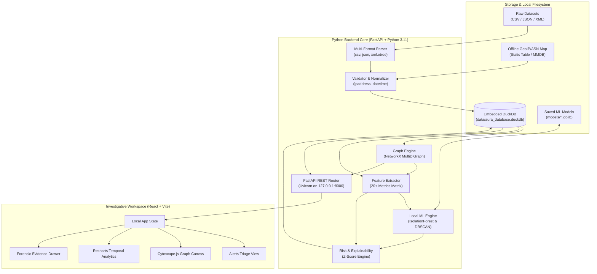
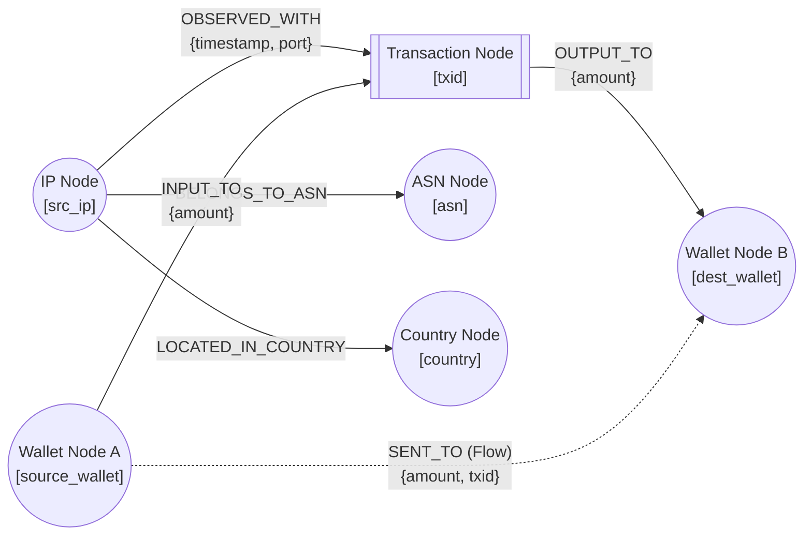
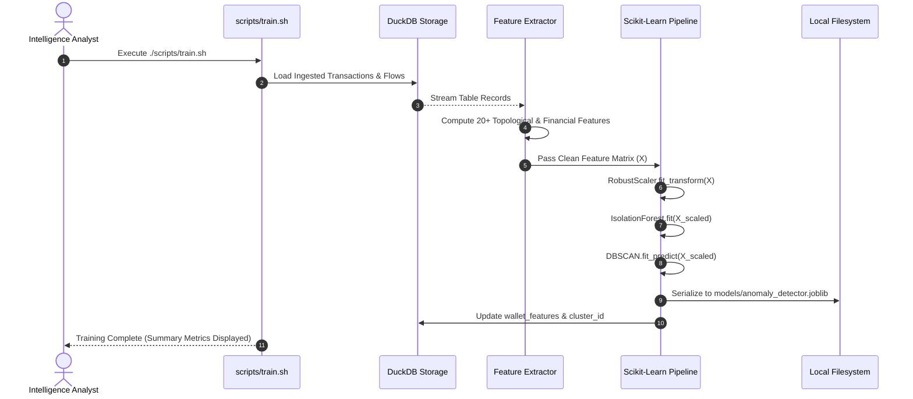
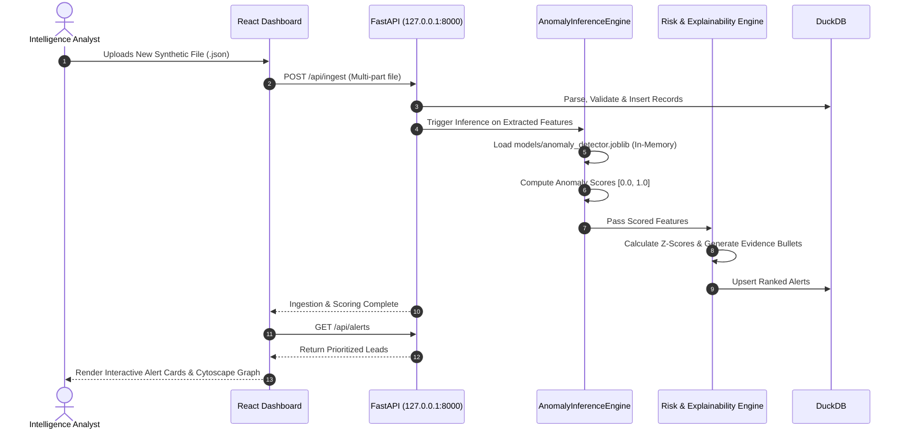
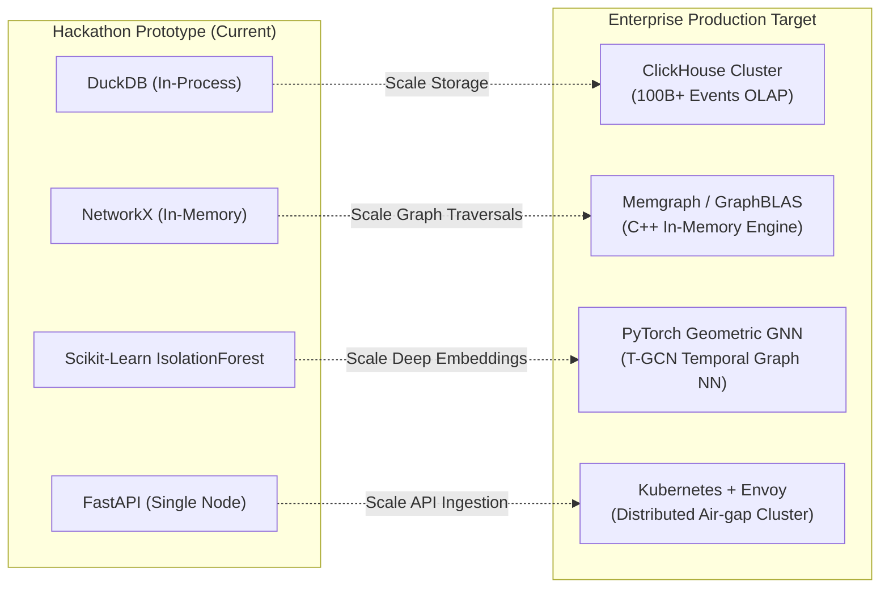

# AURA-BTC: Architecture & Engineering Specification

**Autonomous Offline Bitcoin Intelligence & Traffic Correlation Engine**  
**National Technical Research Organisation (NTRO) - Smart India Hackathon 2026**

---

## TABLE OF CONTENTS

- [SECTION A: Technical Interpretation of the NTRO Problem Statement](#section-a-technical-interpretation-of-the-ntro-problem-statement)
- [SECTION B: Assumptions and Missing Information](#section-b-assumptions-and-missing-information)
- [SECTION C: Complete Product Requirements Document (PRD)](#section-c-complete-product-requirements-document-prd)
- [SECTION D: Offline System Architecture](#section-d-offline-system-architecture)
- [SECTION E: Data-Flow Architecture](#section-e-data-flow-architecture)
- [SECTION F: DuckDB Schema (Complete DDL)](#section-f-duckdb-schema-complete-ddl)
- [SECTION G: Networking Architecture](#section-g-networking-architecture)
- [SECTION H: Blockchain Analytics Scope](#section-h-blockchain-analytics-scope)
- [SECTION I: NetworkX Graph Model](#section-i-networkx-graph-model)
- [SECTION J: ML Architecture & Code](#section-j-ml-architecture--code)
- [SECTION K: Feature Engineering Specification](#section-k-feature-engineering-specification)
- [SECTION L: Explainability & Risk Engine Architecture](#section-l-explainability--risk-engine-architecture)
- [SECTION M: FastAPI REST Specification](#section-m-fastapi-rest-specification)
- [SECTION N: React Frontend Specification](#section-n-react-frontend-specification)
- [SECTION O: Complete Folder Structure](#section-o-complete-folder-structure)
- [SECTION P: Dependency List & Justifications](#section-p-dependency-list--justifications)
- [SECTION Q: Components Explicitly Rejected & Why](#section-q-components-explicitly-rejected--why)
- [SECTION R: Training Workflow](#section-r-training-workflow)
- [SECTION S: Local Inference Workflow](#section-s-local-inference-workflow)
- [SECTION T: Testing Strategy](#section-t-testing-strategy)
- [SECTION U: Development Roadmap (Phases 1–15)](#section-u-development-roadmap-phases-115)
- [SECTION V: Definition of Done (DoD)](#section-v-definition-of-done-dod)
- [SECTION W: Technical Risks & Mitigations](#section-w-technical-risks--mitigations)
- [SECTION X: SIH Demo Workflow & Forensic Scenarios](#section-x-sih-demo-workflow--forensic-scenarios)
- [SECTION Y: 5-Minute Judge Demonstration Sequence](#section-y-5-minute-judge-demonstration-sequence)
- [SECTION Z: Future Production-Scale Upgrade Path](#section-z-future-production-scale-upgrade-path)

---

## SECTION A: Technical Interpretation of the NTRO Problem Statement

The NTRO Smart India Hackathon problem statement challenges us to build an offline, intelligent monitoring platform that bridges two disparate layers of cyber observation:
1. **Network-Layer Metadata:** IP addresses, port numbers, timestamps, ASNs, and geographic origins representing the peer-to-peer (P2P) broadcast points and relay nodes across the global Bitcoin network.
2. **Blockchain-Layer Financial Data:** Cryptographic transaction IDs (TXIDs), input/output wallet addresses, satoshi/BTC transaction values, script types (e.g., P2PKH, SegWit, Taproot), and fee metrics representing on-chain value movement.

### Categorization Matrix

| Requirement Element | Classification | Rationale & Scope Boundary |
|---|---|---|
| Ingest synthetic bulk data in CSV, JSON, XML | **Explicit NTRO Requirement** | The ingestion engine must support multi-format parsing for tabular (CSV), hierarchical (JSON), and tagged (XML) payloads without relying on internet libraries. |
| Ingest network fields (`src_ip`, `dst_ip`, `src_port`, `dst_port`, `timestamp`, `country`, `asn`) | **Explicit NTRO Requirement** | Must be validated, parsed, and indexed for rapid network entity correlation. |
| Ingest blockchain fields (`txid`, `input_wallets`, `output_wallets`, `input_amounts`, `output_amounts`, `fee`, `script_type`) | **Explicit NTRO Requirement** | Must accurately track Unspent Transaction Outputs (UTXO) relationships, values, and fees. |
| Correlate Network & Blockchain Layers | **Explicit NTRO Requirement** | Map which IP vantage point(s) broadcast, relayed, or observed specific TXIDs, linking physical network topology to logical value transfer. |
| Entity & Transaction Graph Generation | **Explicit NTRO Requirement** | Directed graph connecting IP nodes, Wallet nodes, Transaction nodes, Country nodes, and ASN nodes. |
| Unsupervised AI/ML Anomaly Detection | **Explicit NTRO Requirement** | Machine learning (not solely hardcoded IF/ELSE rules) to detect outliers in transaction volume, velocity, network dispersion, and graph topology. |
| Prioritized Investigative Leads & Explainability | **Explicit NTRO Requirement** | Generated alerts must not be "black-box" outputs; each alert must provide ranked evidence explaining why an entity was flagged. |
| Visual Graph & Interactive Dashboard | **Explicit NTRO Requirement** | An interactive user interface allowing analysts to search, trace flows, and inspect alerts. |
| Offline Linux Operation | **Explicit NTRO Requirement** | Zero runtime internet connectivity; no cloud APIs, no external databases. |
| Local In-Memory / Embedded Storage (DuckDB) | **Engineering Interpretation** | DuckDB provides lightning-fast columnar analytical execution, vectorised SQL queries, zero server maintenance, and persistence in a single file. |
| NetworkX Graph Representation | **Engineering Interpretation** | In-memory `MultiDiGraph` enables sub-graph extraction, multi-hop path tracing, and topological feature computation without a heavy Neo4j server. |
| Scikit-Learn Isolation Forest Pipeline | **Engineering Interpretation** | High efficiency for tabular multidimensional anomaly detection without requiring ground-truth criminal labels (unsupervised). |
| Heuristic Multi-Factor Risk Scoring Engine | **Engineering Interpretation** | Blends ML anomaly score (0.0–1.0), graph structural risk, and network dispersion risk into an actionable, calibrated priority index (0–100). |
| Synthetic Dataset Generator & Attack Scenarios | **Optional Proposed Improvement** | Built-in offline dataset generator that synthesizes realistic normal traffic alongside 4 specific cybercrime patterns (peeling chains, mixers, IP hopping, ransomware cashout) to provide rich demo capability. |
| Automated PDF/Markdown Case Report Exporter | **Optional Proposed Improvement** | One-click export of an investigation dossier detailing the flagged wallet, associated IPs, transaction timeline, evidence bullets, and subgraph snapshot for formal law enforcement reporting. |

---

## SECTION B: Assumptions and Missing Information

### 1. The Missing "Suggested AI/ML Focus Areas" Table
The official NTRO problem statement references a "Suggested AI/ML Focus Areas" table that was omitted from the prompt. Rather than fabricating imaginary NTRO mandates, we adopt standard, proven financial cyber-threat intelligence focus areas:
- **Rapid Value Dissipation (Peeling Chains & Layering):** Rapid successive transactions splitting funds into smaller change outputs.
- **Mixer / Tumbler Topologies (Fan-out / Fan-in):** One wallet sending to many intermediate addresses which quickly converge into a few destination addresses.
- **Multi-Jurisdiction Network Hopping:** A single wallet address or related cluster broadcast from multiple anomalous ASNs/Countries within seconds (impossible physical travel time).
- **Abnormal Fee / Volume Spikes:** High transaction fees paid to force rapid mempool clearing, or anomalous transaction values far outside baseline percentiles.

### 2. Nature of Synthetic Datasets
- We assume raw input files contain a mixture of flat records (one row per network observation + transaction) and nested records (one transaction having an array of inputs/outputs).
- The normalizer must handle both flat 1:1 mappings and 1:N / N:M transaction input/output arrays.

### 3. P2P Network Vantage Points & Tor/VPN Limitations
- In standard Bitcoin P2P gossip protocol (over TCP port 8333), nodes broadcast `inv` and `tx` messages. The `src_ip` observed in synthetic metadata represents the first-seen vantage point or relay node.
- **Critical Forensics Assumption:** An IP observed broadcasting a TXID is *evidence of network broadcast observation*, NOT cryptographic proof of real-world device ownership. If Tor/VPN exit nodes are used, the IP reflects the exit gateway. The system must treat this as a probabilistic association with confidence scores.

### 4. Offline GeoIP / ASN Enrichment
- Since external GeoIP APIs (e.g., ipinfo.io, MaxMind web service) are forbidden, we utilize an embedded local offline IP-range-to-Country/ASN lookup table stored directly in DuckDB or loaded from a static offline `.csv`/`.mmdb` file.

---

## SECTION C: Complete Product Requirements Document (PRD)

```
================================================================================
                    PRODUCT REQUIREMENTS DOCUMENT (PRD)
                      AURA-BTC INVESTIGATION PLATFORM
================================================================================
```

### 1. Product Name
**AURA-BTC** (Autonomous Offline Bitcoin Intelligence & Traffic Correlation Engine).

### 2. Executive Summary
AURA-BTC is an offline Linux-native desktop/server software suite designed for cyber-defense agencies (such as NTRO) and financial intelligence units (FIUs). It automatically ingests heterogeneous Bitcoin transaction and P2P network metadata, correlates on-chain flows with network broadcast points, builds an interactive multi-dimensional entity graph, executes unsupervised machine learning anomaly detection, and provides explainable, prioritized investigative dossiers.

### 3. Problem Statement
Illicit actors utilize cryptocurrency to obfuscate extortion payments, ransomware ransoms, cyber-espionage funding, and money laundering. Traditional block explorers lack network-layer context, while standard network sniffers cannot decode on-chain cryptographic UTXO flows. Investigating officers need an integrated, offline-first tool to rapidly ingest bulk data, uncover hidden relationships, identify high-risk anomalies, and generate court-admissible technical evidence without risking operational security via cloud connectivity.

### 4. User Personas
1. **Cyber Intelligence Analyst (Primary):** Needs to triage high-volume transaction feeds, sort by risk score, inspect network origin anomalies, and generate visual transaction traces.
2. **Law Enforcement Investigator:** Searches specific wallet addresses or TXIDs, reviews timeline evidence, and exports formal investigation reports.
3. **Data Scientist / Threat Researcher:** Tunes ML threshold parameters, analyzes feature distributions, retrains local models, and inspects clustering structures.

### 5. Objectives
- Ingest 100,000+ transaction/network events within 10 seconds.
- Correlate 100% of valid network events with corresponding TXIDs.
- Generate unified graph models (IP $\leftrightarrow$ TXID $\leftrightarrow$ Wallet $\leftrightarrow$ ASN $\leftrightarrow$ Country).
- Produce local, CPU-based ML anomaly scores and top-5 contributing forensic reasons for every alert.
- Guarantee 100% air-gapped, offline execution on Ubuntu Linux.

### 6. Non-Objectives
- Live packet capture (PCAP sniffing) or hardware TAP integration (focus is on ingested metadata files).
- Private key recovery, wallet decryption, or cryptographic signature breaking.
- Modifying blockchain consensus or mining Bitcoin blocks.
- Real-time automated bank account freezing or non-intelligence judicial enforcement.

### 7. Functional Requirements (FR)
- **FR-01 (Multi-Format Ingestion):** Parse `.csv`, `.json`, and `.xml` metadata files.
- **FR-02 (Data Normalization):** Sanitize IP addresses (IPv4/IPv6), convert timestamps to ISO-8601 UTC, validate port numbers (1–65535), and standardize satoshi amounts.
- **FR-03 (Offline Enrichment):** Match IP addresses against local DuckDB tables to enrich Country Code and ASN metadata.
- **FR-04 (Entity Graph Construction):** Create directed NetworkX graphs representing Wallets, Transactions, IPs, ASNs, and Countries.
- **FR-05 (Feature Calculation):** Compute 20+ topological, temporal, and monetary features for each wallet address.
- **FR-06 (ML Anomaly Scoring):** Execute local scikit-learn `IsolationForest` model to assign anomaly scores $[0.0, 1.0]$.
- **FR-07 (Entity Clustering):** Apply DBSCAN to group structurally similar transaction patterns into entity clusters.
- **FR-08 (Risk & Confidence Calibration):** Calculate Composite Risk Score (0–100) and Confidence Level (LOW/MED/HIGH).
- **FR-09 (Explainability Engine):** Compute statistical baseline deviations (Z-scores) to generate readable evidence bullets.
- **FR-10 (Triage Dashboard):** Render ranked alerts with filtering by severity, country, and risk threshold.
- **FR-11 (Interactive Graph Canvas):** Cytoscape.js interactive visualization with node drag, zoom, neighborhood expansion, and metadata drawer.
- **FR-12 (Case Dossier Export):** Export evidence summaries into structured Markdown/PDF formats.

### 8. Non-Functional Requirements (NFR)
- **NFR-01 (Offline Operation):** System must boot, ingest, train, infer, and visualize with physical network interfaces disabled.
- **NFR-02 (Low Latency):** Single-entity graph search must respond in $<100\text{ ms}$; full dashboard load in $<500\text{ ms}$.
- **NFR-03 (Memory Efficiency):** Maximum resident set size (RSS) memory $<2\text{ GB}$ for $500,000$ records.
- **NFR-04 (Deterministic Reproducibility):** Fixed random seed (`seed=42`) across ML models ensuring reproducible outputs.
- **NFR-05 (Platform Portability):** Zero-compilation execution on standard Ubuntu 20.04/22.04/24.04 LTS installations.

### 9. Offline Requirements
- All JavaScript/CSS assets (React, Vite, Cytoscape.js, Recharts, fonts) bundled locally; zero external CDN `<script>` tags.
- Python dependencies installed via local offline wheels or bundled `uv` cache.
- Local SQLite/DuckDB embedded binaries—no background server daemons required.

### 10. Security Requirements
- Input sanitization against XML External Entity (XXE) injection using `defusedxml` or safe `xml.etree.ElementTree` parsing without external entity resolution.
- Parameterized DuckDB SQL queries to eliminate SQL injection vulnerabilities.
- Localhost binding (`127.0.0.1`) for FastAPI server to prevent unintended LAN exposure.

### 11. Data Requirements
- Support both flat schema (single row per UTXO event) and nested schema (array of inputs/outputs per TXID).
- Graceful handling of missing fields (e.g., unknown ASN $\rightarrow$ `"ASN-UNKNOWN"`).

### 12. Network-Analysis Requirements
- Distinguish between standard Bitcoin P2P ports (8333, 18333), RPC ports (8332), and dynamic/ephemeral ports (49152–65535).
- Detect multi-homed broadcasting (same TXID seen from $\ge 3$ distinct subnets within 5 seconds).

### 13. Graph-Analysis Requirements
- Extract $k$-hop ego-networks around any target wallet or TXID.
- Calculate In-Degree (fan-in), Out-Degree (fan-out), and Betweenness Centrality.

### 14. ML Requirements
- Unsupervised Isolation Forest trained on normalized feature matrix.
- Ability to retrain model on new ingested data via single API endpoint `/api/ml/train`.
- Model artifact saved locally as `models/anomaly_detector.joblib`.

### 15. Explainability Requirements
- Dynamic generation of 3 to 5 clear evidence bullets for every alert.
- Clear numeric comparison against dataset medians (e.g., *"Transaction volume is 14.2× higher than dataset median"*).

### 16. Dashboard Requirements
- Single-page dark-themed operational UI with instant search, interactive Cytoscape canvas, risk badges, and tabular triage queue.

### 17. API Requirements
- RESTful JSON API using FastAPI with automatic OpenAPI docs (`/docs`) available locally.

### 18. Database Requirements
- Columnar DuckDB file stored at `data/aura_database.duckdb`. Support ACID transactions and in-memory fallback.

### 19. Performance Requirements
- Ingestion rate: $\ge 10,000\text{ records/sec}$.
- Feature extraction: $\ge 5,000\text{ wallets/sec}$.
- Batch ML scoring: $\le 200\text{ ms}$ for $10,000$ entities.

### 20. Error-Handling Requirements
- Malformed rows in CSV/JSON/XML must be logged to an ingestion error table without aborting the entire batch.

### 21. Acceptance Criteria (Given / When / Then)
- **AC-1:** *Given* a 50MB mixed CSV/JSON/XML dataset, *When* ingested via UI/API, *Then* all valid records appear in DuckDB within 5 seconds with zero internet calls.
- **AC-2:** *Given* an anomalous wallet participating in a peeling chain, *When* feature extraction and ML inference run, *Then* the wallet is assigned a Risk Score $>80$ and flagged as `CRITICAL` with human-readable evidence.
- **AC-3:** *Given* a user clicks any node on the Cytoscape graph, *When* inspected, *Then* an evidence drawer opens displaying associated IPs, total volume, ASN, country, and risk breakdown.

### 22. Technical Risks
- *Graph combinatorial explosion:* Graphing millions of nodes simultaneously in the browser can freeze Cytoscape.js.  
  *Mitigation:* Server-side sub-graph slicing ($k$-hop ego graphs limited to max 100 nodes/edges per view).

### 23. Dependency Risks
- *Broken offline builds:* NPM or Pip trying to connect to remote registries during evaluation.  
  *Mitigation:* Self-contained `package-lock.json`, pre-bundled frontend `dist/` directory, and local `uv` lockfile.

### 24. ML Risks
- *High-volume exchanges flagged as attackers:* Centralized exchanges have high fan-in/fan-out, mimicking mixing behavior.  
  *Mitigation:* Heuristic whitelisting / tag identification for high-degree liquidity hubs.

### 25. False-Positive Risks
- *Normal users using VPNs:* Multiple IPs might look like network hopping.  
  *Mitigation:* Confidence score reduced if temporal spacing between IP appearances is realistic for normal human movement.

### 26. Privacy and Attribution Limitations
- The system explicitly records intelligence correlation, NOT physical legal identity. All findings must state *"Evidence indicates potential correlation"*.

### 27. Future Improvements
- Multi-asset support (Ethereum, Monero transaction tracing), cross-chain bridge analytics, GPU-accelerated Graph Neural Networks (GNNs).

---

## SECTION D: Offline System Architecture



### Architecture Key Principles
1. **Zero External Sockets:** All API traffic routes strictly over `127.0.0.1:8000`. No external network probes or DNS queries are initiated.
2. **Embedded Analytics Engine:** DuckDB runs in-process inside Python, eliminating network socket overhead and standalone database maintenance.
3. **In-Memory Graph Topology:** NetworkX holds active subgraphs in memory for rapid graph traversal, degree calculation, and neighborhood retrieval.

---

## SECTION E: Data-Flow Architecture

```
+-------------------------------------------------------------------------------------------------------------+
|                                           DATA-FLOW LIFECYCLE                                               |
+-------------------------------------------------------------------------------------------------------------+

[STAGE 1: Ingestion]
  Raw File (.csv / .json / .xml)
    │
    ▼
[STAGE 2: Parsing & Validation]
  • XML/JSON/CSV Parser -> Extract: [timestamp, src_ip, dst_ip, src_port, dst_port, txid, inputs, outputs, fee]
  • Python `ipaddress` validation -> Eliminate invalid octets, sanitize loopbacks
  • Python `datetime` validation -> Standardize to UTC ISO-8601 (YYYY-MM-DDTHH:MM:SSZ)
  • Port validation -> Check 1..65535, tag Bitcoin P2P (8333) vs RPC (8332) vs Ephemeral
    │
    ▼
[STAGE 3: Offline GeoIP/ASN Enrichment]
  • Match `src_ip` against local DuckDB subnet table -> Enrich [CountryCode, ASN, OrgName]
    │
    ▼
[STAGE 4: DuckDB Analytical Storage]
  • Batch INSERT into tables: `network_events`, `transactions`, `wallet_flows`
    │
    ▼
[STAGE 5: Topological Graph Construction]
  • Query DuckDB -> Build NetworkX `MultiDiGraph`
  • Nodes: (Wallet, Transaction, IP, ASN, Country)
  • Edges: (INPUT_TO, OUTPUT_TO, OBSERVED_WITH, BELONGS_TO_ASN, LOCATED_IN_COUNTRY)
    │
    ▼
[STAGE 6: Multi-Dimensional Feature Extraction]
  • Calculate 20+ numerical metrics per wallet (Velocity, Fan-In/Out, IP Diversity, Volume, Graph Degree)
  • Save/Update table: `wallet_features`
    │
    ▼
[STAGE 7: Unsupervised ML Anomaly Detection]
  • Scikit-learn `IsolationForest.fit_predict(X_scaled)`
  • Map decision function to normalized Anomaly Score [0.0, 1.0]
  • Optional: `DBSCAN.fit_predict(X_scaled)` for flow clustering
    │
    ▼
[STAGE 8: Explainability & Composite Risk Scoring]
  • Calculate Z-score for each feature against population mean/median
  • Identify Top-3 outlier features contributing to anomaly
  • Compute Composite Risk Score = 0.50*(ML Score*100) + 0.25*(Graph Risk) + 0.25*(Network Risk)
  • Classify Severity: CRITICAL (>=80), HIGH (60-79), MEDIUM (40-59), LOW (<40)
  • Write to table: `alerts`
    │
    ▼
[STAGE 9: REST API Serving & Client-Side Visualization]
  • FastAPI serves endpoints: `/api/alerts`, `/api/graph/entity/{id}`, `/api/stats`
  • React client renders Cytoscape canvas, Recharts timeline, and prioritized triage queue
```

---

## SECTION F: DuckDB Schema (Complete DDL)

DuckDB is utilized as the embedded columnar database engine. Below is the complete, self-contained SQL DDL script:

```sql
-- ============================================================================
-- AURA-BTC DUCKDB DATABASE SCHEMA (OFFLINE EMBEDDED OLAP)
-- File: data/schema.sql
-- ============================================================================

-- 1. Table: network_events
-- Stores raw and normalized network broadcast observations
CREATE TABLE IF NOT EXISTS network_events (
    event_id VARCHAR PRIMARY KEY,
    timestamp TIMESTAMP NOT NULL,
    src_ip VARCHAR NOT NULL,
    dst_ip VARCHAR NOT NULL,
    src_port INTEGER NOT NULL CHECK (src_port BETWEEN 1 AND 65535),
    dst_port INTEGER NOT NULL CHECK (dst_port BETWEEN 1 AND 65535),
    txid VARCHAR NOT NULL,
    country VARCHAR DEFAULT 'UNKNOWN',
    asn VARCHAR DEFAULT 'UNKNOWN',
    is_p2p_port BOOLEAN DEFAULT TRUE,
    created_at TIMESTAMP DEFAULT CURRENT_TIMESTAMP
);

CREATE INDEX IF NOT EXISTS idx_net_txid ON network_events(txid);
CREATE INDEX IF NOT EXISTS idx_net_src_ip ON network_events(src_ip);
CREATE INDEX IF NOT EXISTS idx_net_timestamp ON network_events(timestamp);

-- 2. Table: transactions
-- Stores on-chain Bitcoin transaction details
CREATE TABLE IF NOT EXISTS transactions (
    txid VARCHAR PRIMARY KEY,
    timestamp TIMESTAMP NOT NULL,
    total_input DECIMAL(18, 8) NOT NULL CHECK (total_input >= 0),
    total_output DECIMAL(18, 8) NOT NULL CHECK (total_output >= 0),
    fee DECIMAL(18, 8) NOT NULL CHECK (fee >= 0),
    script_type VARCHAR DEFAULT 'P2PKH', -- P2PKH, P2SH, P2WPKH (SegWit), P2TR (Taproot)
    input_count INTEGER NOT NULL DEFAULT 1,
    output_count INTEGER NOT NULL DEFAULT 1,
    created_at TIMESTAMP DEFAULT CURRENT_TIMESTAMP
);

CREATE INDEX IF NOT EXISTS idx_tx_timestamp ON transactions(timestamp);

-- 3. Table: wallet_flows
-- Stores atomic value transfers between source wallets and destination wallets via transactions
CREATE TABLE IF NOT EXISTS wallet_flows (
    flow_id VARCHAR PRIMARY KEY,
    txid VARCHAR NOT NULL,
    source_wallet VARCHAR NOT NULL,
    destination_wallet VARCHAR NOT NULL,
    amount DECIMAL(18, 8) NOT NULL CHECK (amount > 0),
    timestamp TIMESTAMP NOT NULL,
    FOREIGN KEY (txid) REFERENCES transactions(txid)
);

CREATE INDEX IF NOT EXISTS idx_flow_src ON wallet_flows(source_wallet);
CREATE INDEX IF NOT EXISTS idx_flow_dst ON wallet_flows(destination_wallet);
CREATE INDEX IF NOT EXISTS idx_flow_txid ON wallet_flows(txid);

-- 4. Table: wallet_features
-- Stores engineered statistical, temporal, and topological features per wallet
CREATE TABLE IF NOT EXISTS wallet_features (
    wallet_address VARCHAR PRIMARY KEY,
    transaction_count INTEGER NOT NULL DEFAULT 0,
    incoming_count INTEGER NOT NULL DEFAULT 0,
    outgoing_count INTEGER NOT NULL DEFAULT 0,
    total_received DECIMAL(18, 8) NOT NULL DEFAULT 0.0,
    total_sent DECIMAL(18, 8) NOT NULL DEFAULT 0.0,
    average_transaction_value DECIMAL(18, 8) NOT NULL DEFAULT 0.0,
    maximum_transaction_value DECIMAL(18, 8) NOT NULL DEFAULT 0.0,
    amount_variance DECIMAL(18, 8) NOT NULL DEFAULT 0.0,
    unique_counterparties INTEGER NOT NULL DEFAULT 0,
    fan_in_degree INTEGER NOT NULL DEFAULT 0,
    fan_out_degree INTEGER NOT NULL DEFAULT 0,
    unique_ip_count INTEGER NOT NULL DEFAULT 0,
    unique_asn_count INTEGER NOT NULL DEFAULT 0,
    unique_country_count INTEGER NOT NULL DEFAULT 0,
    transactions_per_hour DECIMAL(10, 4) NOT NULL DEFAULT 0.0,
    average_time_between_transactions DECIMAL(12, 2) NOT NULL DEFAULT 0.0,
    rapid_transaction_count INTEGER NOT NULL DEFAULT 0,
    graph_degree INTEGER NOT NULL DEFAULT 0,
    in_out_ratio DECIMAL(10, 4) NOT NULL DEFAULT 0.0,
    active_duration_seconds BIGINT NOT NULL DEFAULT 0,
    cluster_id INTEGER DEFAULT -1,
    last_updated TIMESTAMP DEFAULT CURRENT_TIMESTAMP
);

-- 5. Table: alerts
-- Stores flagged investigative leads with scores and human-readable explanations
CREATE TABLE IF NOT EXISTS alerts (
    alert_id VARCHAR PRIMARY KEY,
    entity_type VARCHAR NOT NULL, -- 'WALLET', 'TRANSACTION', 'IP_CLUSTER'
    entity_id VARCHAR NOT NULL,
    anomaly_score DECIMAL(5, 4) NOT NULL, -- ML score 0.0000 to 1.0000
    risk_score INTEGER NOT NULL CHECK (risk_score BETWEEN 0 AND 100),
    confidence_score VARCHAR NOT NULL, -- 'LOW', 'MEDIUM', 'HIGH'
    severity VARCHAR NOT NULL, -- 'LOW', 'MEDIUM', 'HIGH', 'CRITICAL'
    explanation_json VARCHAR NOT NULL, -- JSON array of evidence strings
    top_features VARCHAR NOT NULL,     -- JSON dict of top outlier features
    is_resolved BOOLEAN DEFAULT FALSE,
    created_at TIMESTAMP DEFAULT CURRENT_TIMESTAMP
);

CREATE INDEX IF NOT EXISTS idx_alerts_risk ON alerts(risk_score DESC);
CREATE INDEX IF NOT EXISTS idx_alerts_severity ON alerts(severity);

-- 6. Table: geo_asn_lookup (Offline Static Reference)
CREATE TABLE IF NOT EXISTS geo_asn_lookup (
    ip_prefix VARCHAR PRIMARY KEY,
    country_code VARCHAR(2) NOT NULL,
    country_name VARCHAR NOT NULL,
    asn VARCHAR NOT NULL,
    as_org VARCHAR NOT NULL
);

-- 7. View: v_entity_summary (Convenience analytical view)
CREATE OR REPLACE VIEW v_entity_summary AS
SELECT 
    w.wallet_address,
    w.transaction_count,
    w.total_received,
    w.total_sent,
    w.fan_out_degree,
    w.unique_country_count,
    COALESCE(a.risk_score, 0) AS risk_score,
    COALESCE(a.severity, 'UNFLAGGED') AS severity,
    a.explanation_json
FROM wallet_features w
LEFT JOIN alerts a ON w.wallet_address = a.entity_id;
```

---

## SECTION G: Networking Architecture

### 1. Network Field Interpretation & Standard Library Validation

We utilize Python’s standard library (`ipaddress`, `datetime`, `dataclasses`) to ensure dependency-free, robust parsing.

```python
import ipaddress
from datetime import datetime, timezone
from dataclasses import dataclass
from typing import Optional, Tuple

@dataclass(frozen=True)
class NetworkObservation:
    src_ip: str
    dst_ip: str
    src_port: int
    dst_port: int
    timestamp: datetime
    txid: str
    country: str
    asn: str
    is_valid: bool
    error_reason: Optional[str] = None

def parse_and_validate_network_event(raw: dict) -> Tuple[bool, Optional[NetworkObservation], Optional[str]]:
    """
    Validates IP addresses, port ranges, and ISO timestamps using Python stdlib.
    """
    try:
        # 1. IP Validation
        src_ip_obj = ipaddress.ip_address(raw['src_ip'].strip())
        dst_ip_obj = ipaddress.ip_address(raw['dst_ip'].strip())
        
        # 2. Port Validation (1 - 65535)
        src_port = int(raw['src_port'])
        dst_port = int(raw['dst_port'])
        if not (1 <= src_port <= 65535 and 1 <= dst_port <= 65535):
            return False, None, f"Invalid port range: {src_port}->{dst_port}"

        # 3. Timestamp Normalization to UTC
        raw_ts = raw['timestamp'].strip()
        if raw_ts.endswith('Z'):
            raw_ts = raw_ts[:-1] + '+00:00'
        ts_obj = datetime.fromisoformat(raw_ts).astimezone(timezone.utc)

        # 4. TXID Sanitization (64 hex characters)
        txid = raw['txid'].strip().lower()
        if len(txid) != 64 or not all(c in '0123456789abcdef' for c in txid):
            return False, None, f"Malformed TXID format: {txid}"

        country = raw.get('country', 'UNKNOWN').strip().upper()
        asn = raw.get('asn', 'UNKNOWN').strip().upper()

        obs = NetworkObservation(
            src_ip=str(src_ip_obj),
            dst_ip=str(dst_ip_obj),
            src_port=src_port,
            dst_port=dst_port,
            timestamp=ts_obj,
            txid=txid,
            country=country,
            asn=asn,
            is_valid=True
        )
        return True, obs, None

    except ValueError as ve:
        return False, None, f"Validation failure: {str(ve)}"
    except Exception as e:
        return False, None, f"Unexpected error: {str(e)}"
```

### 2. Network Forensics Interpretation Boundaries

| Observed Field | Legitimate Forensic Inference | ILLEGITIMATE / Invalid Inference |
|---|---|---|
| `src_ip` | Network vantage point or first-seen relay node broadcasting the transaction. | Proof of real-world human identity or physical location of the wallet owner. |
| `dst_ip` | Peer node receiving the transaction `inv`/`tx` gossip message. | Proof of transaction recipient or beneficiary. |
| `src_port` / `dst_port` | Identifies standard P2P relay (8333), Testnet (18333), RPC daemon (8332), or ephemeral client NAT port. | Proof of specific operating system or malicious intent. |
| `timestamp` | Propagation arrival time at the observation probe. | Proof of exact local wall-clock time on the creator's device. |
| `ASN` | Autonomous System (ISP, Cloud Host, VPN provider, Tor Relay) hosting the broadcast node. | Proof that the ISP colluded with the transaction originator. |
| `Country` | Geographic registration of the IP block according to BGP routing tables. | Legal nationality or citizenship of the wallet creator. |

---

## SECTION H: Blockchain Analytics Scope

To maintain high development velocity and avoid unnecessary complexity, the technical scope is strictly defined:

```
+-----------------------------------------------------------------------------+
|                          BLOCKCHAIN SCOPE BOUNDARY                          |
+-----------------------------------------------------------------------------+
|  [IN SCOPE]                                                                 |
|   • UTXO (Unspent Transaction Output) tracking: Inputs, Outputs, Change.   |
|   • Standard Bitcoin Address Formats:                                       |
|       - Legacy P2PKH (starts with '1...')                                   |
|       - Nested P2SH (starts with '3...')                                    |
|       - Native SegWit P2WPKH (starts with 'bc1q...')                        |
|       - Taproot P2TR (starts with 'bc1p...')                                |
|   • Satoshis to BTC conversion (1 BTC = 100,000,000 Satoshis).              |
|   • Transaction Fees = Total Input Amount - Total Output Amount.             |
|   • Mempool / Relay Gossip vs Confirmed On-Chain transactions.              |
|   • Multi-input Heuristic (Co-spending implies common wallet ownership).    |
+-----------------------------------------------------------------------------+
|  [OUT OF SCOPE - EXPLICITLY FORBIDDEN]                                      |
|   ❌ Smart contract execution (EVM, Solidity, Vyper).                       |
|   ❌ Mining simulation, Proof-of-Work hashing loops, ASIC algorithms.        |
|   ❌ Consensus engine reimplementation (Nakamoto consensus rules).         |
|   ❌ Private key cryptography, ECDSA signing, HD wallet seed derivation.    |
|   ❌ Full archival node syncing (No downloading 600GB blockchain).          |
+-----------------------------------------------------------------------------+
```

---

## SECTION I: NetworkX Graph Model

### 1. Node & Edge Ontology



### 2. Graph Construction Implementation

```python
# File: src/graph/builder.py
import networkx as nx
import duckdb
from typing import Dict, Any, List

def build_entity_graph_from_duckdb(con: duckdb.DuckDBPyConnection) -> nx.MultiDiGraph:
    """
    Constructs an in-memory MultiDiGraph from DuckDB transaction, flow, and network tables.
    """
    G = nx.MultiDiGraph()

    # 1. Add Transactions
    tx_df = con.execute("""
        SELECT txid, timestamp, total_input, total_output, fee, script_type 
        FROM transactions
    """).fetchdf()

    for _, row in tx_df.iterrows():
        G.add_node(
            row['txid'],
            node_type='TRANSACTION',
            timestamp=str(row['timestamp']),
            total_input=float(row['total_input']),
            total_output=float(row['total_output']),
            fee=float(row['fee']),
            script_type=row['script_type']
        )

    # 2. Add Wallet Flows & Wallet Nodes
    flows_df = con.execute("""
        SELECT flow_id, txid, source_wallet, destination_wallet, amount, timestamp 
        FROM wallet_flows
    """).fetchdf()

    for _, row in flows_df.iterrows():
        src = row['source_wallet']
        dst = row['destination_wallet']
        txid = row['txid']
        amount = float(row['amount'])

        if not G.has_node(src):
            G.add_node(src, node_type='WALLET', address=src)
        if not G.has_node(dst):
            G.add_node(dst, node_type='WALLET', address=dst)

        # Connect Wallet -> TX and TX -> Wallet
        G.add_edge(src, txid, edge_type='INPUT_TO', amount=amount)
        G.add_edge(txid, dst, edge_type='OUTPUT_TO', amount=amount)
        # Direct logical flow edge
        G.add_edge(src, dst, edge_type='SENT_TO', amount=amount, txid=txid, timestamp=str(row['timestamp']))

    # 3. Add Network Events & IP / ASN / Country Nodes
    net_df = con.execute("""
        SELECT event_id, src_ip, dst_ip, src_port, dst_port, txid, country, asn, timestamp 
        FROM network_events
    """).fetchdf()

    for _, row in net_df.iterrows():
        ip = row['src_ip']
        txid = row['txid']
        asn = row['asn']
        ctry = row['country']

        if not G.has_node(ip):
            G.add_node(ip, node_type='IP', ip=ip)
        if asn != 'UNKNOWN' and not G.has_node(asn):
            G.add_node(asn, node_type='ASN', asn=asn)
        if ctry != 'UNKNOWN' and not G.has_node(ctry):
            G.add_node(ctry, node_type='COUNTRY', country=ctry)

        # Connect IP to Transaction
        if G.has_node(txid):
            G.add_edge(ip, txid, edge_type='OBSERVED_WITH', port=int(row['src_port']), timestamp=str(row['timestamp']))

        # Connect IP to ASN and Country
        if asn != 'UNKNOWN':
            G.add_edge(ip, asn, edge_type='BELONGS_TO_ASN')
        if ctry != 'UNKNOWN':
            G.add_edge(ip, ctry, edge_type='LOCATED_IN_COUNTRY')

    return G

def get_k_hop_subgraph(G: nx.MultiDiGraph, center_node: str, k: int = 2) -> Dict[str, Any]:
    """
    Extracts k-hop neighborhood around a target node and converts to Cytoscape-compatible JSON.
    """
    if center_node not in G:
        return {"nodes": [], "edges": []}

    sub_nodes = set([center_node])
    current_frontier = set([center_node])
    
    for _ in range(k):
        next_frontier = set()
        for node in current_frontier:
            neighbors = set(G.predecessors(node)).union(set(G.successors(node)))
            next_frontier.update(neighbors)
        sub_nodes.update(next_frontier)
        current_frontier = next_frontier
        if len(sub_nodes) > 150: # Protect against canvas freezing
            break

    subgraph = G.subgraph(sub_nodes)

    cy_nodes = []
    for node_id, data in subgraph.nodes(data=True):
        cy_nodes.append({
            "data": {
                "id": node_id,
                "label": f"{data.get('node_type', 'NODE')}: {node_id[:10]}...",
                **data
            }
        })

    cy_edges = []
    for u, v, k, data in subgraph.edges(keys=True, data=True):
        cy_edges.append({
            "data": {
                "id": f"{u}_{v}_{k}",
                "source": u,
                "target": v,
                **data
            }
        })

    return {"nodes": cy_nodes, "edges": cy_edges}
```

---

## SECTION J: ML Architecture & Code

### 1. ML Strategy & Principles
- **Unsupervised Paradigm:** In real-world cyber defense, labeled ground-truth datasets of confirmed criminal Bitcoin transactions are virtually non-existent or heavily skewed.
- **Model Choice:** `IsolationForest` from `scikit-learn`. It isolates anomalies by randomly selecting a feature and splitting the value; anomalous points require fewer splits (shorter path lengths) to be isolated.
- **Local CPU Execution:** Runs in $<50\text{ ms}$ on a standard quad-core CPU; zero requirement for CUDA, GPU, PyTorch, or cloud AI services.

### 2. Feature Extraction (`features.py`)

```python
# File: src/ml/features.py
import duckdb
import pandas as pd
import numpy as np

FEATURE_COLUMNS = [
    'transaction_count',
    'incoming_count',
    'outgoing_count',
    'total_received',
    'total_sent',
    'average_transaction_value',
    'maximum_transaction_value',
    'amount_variance',
    'unique_counterparties',
    'fan_in_degree',
    'fan_out_degree',
    'unique_ip_count',
    'unique_asn_count',
    'unique_country_count',
    'transactions_per_hour',
    'average_time_between_transactions',
    'rapid_transaction_count',
    'graph_degree',
    'in_out_ratio',
    'active_duration_seconds'
]

def extract_wallet_features_from_db(con: duckdb.DuckDBPyConnection) -> pd.DataFrame:
    """
    Computes statistical, temporal, network, and graph features per wallet using SQL aggregations.
    """
    query = """
    WITH wallet_txs AS (
        -- Ingoing flows
        SELECT 
            destination_wallet AS wallet,
            'IN' AS direction,
            amount,
            timestamp,
            txid
        FROM wallet_flows
        UNION ALL
        -- Outgoing flows
        SELECT 
            source_wallet AS wallet,
            'OUT' AS direction,
            amount,
            timestamp,
            txid
        FROM wallet_flows
    ),
    wallet_net AS (
        SELECT 
            w.wallet,
            ne.src_ip,
            ne.asn,
            ne.country
        FROM wallet_txs w
        JOIN network_events ne ON w.txid = ne.txid
    ),
    net_agg AS (
        SELECT 
            wallet,
            COUNT(DISTINCT src_ip) AS unique_ip_count,
            COUNT(DISTINCT asn) AS unique_asn_count,
            COUNT(DISTINCT country) AS unique_country_count
        FROM wallet_net
        GROUP BY wallet
    ),
    tx_agg AS (
        SELECT 
            wallet,
            COUNT(*) AS transaction_count,
            COUNT(CASE WHEN direction = 'IN' THEN 1 END) AS incoming_count,
            COUNT(CASE WHEN direction = 'OUT' THEN 1 END) AS outgoing_count,
            COALESCE(SUM(CASE WHEN direction = 'IN' THEN amount ELSE 0 END), 0.0) AS total_received,
            COALESCE(SUM(CASE WHEN direction = 'OUT' THEN amount ELSE 0 END), 0.0) AS total_sent,
            COALESCE(AVG(amount), 0.0) AS average_transaction_value,
            COALESCE(MAX(amount), 0.0) AS maximum_transaction_value,
            COALESCE(VAR_SAMP(amount), 0.0) AS amount_variance,
            MIN(timestamp) AS first_seen,
            MAX(timestamp) AS last_seen
        FROM wallet_txs
        GROUP BY wallet
    ),
    counterparties AS (
        SELECT 
            wallet,
            COUNT(DISTINCT counterparty) AS unique_counterparties,
            COUNT(DISTINCT CASE WHEN dir = 'IN' THEN counterparty END) AS fan_in_degree,
            COUNT(DISTINCT CASE WHEN dir = 'OUT' THEN counterparty END) AS fan_out_degree
        FROM (
            SELECT source_wallet AS wallet, destination_wallet AS counterparty, 'OUT' AS dir FROM wallet_flows
            UNION ALL
            SELECT destination_wallet AS wallet, source_wallet AS counterparty, 'IN' AS dir FROM wallet_flows
        )
        GROUP BY wallet
    )
    SELECT 
        t.wallet AS wallet_address,
        t.transaction_count,
        t.incoming_count,
        t.outgoing_count,
        t.total_received,
        t.total_sent,
        t.average_transaction_value,
        t.maximum_transaction_value,
        t.amount_variance,
        COALESCE(c.unique_counterparties, 0) AS unique_counterparties,
        COALESCE(c.fan_in_degree, 0) AS fan_in_degree,
        COALESCE(c.fan_out_degree, 0) AS fan_out_degree,
        COALESCE(n.unique_ip_count, 1) AS unique_ip_count,
        COALESCE(n.unique_asn_count, 1) AS unique_asn_count,
        COALESCE(n.unique_country_count, 1) AS unique_country_count,
        CASE 
            WHEN EPOCH(t.last_seen - t.first_seen) > 0 
            THEN (t.transaction_count * 3600.0) / EPOCH(t.last_seen - t.first_seen) 
            ELSE t.transaction_count 
        END AS transactions_per_hour,
        CASE 
            WHEN t.transaction_count > 1 
            THEN EPOCH(t.last_seen - t.first_seen) / (t.transaction_count - 1) 
            ELSE 0.0 
        END AS average_time_between_transactions,
        0 AS rapid_transaction_count, -- Refined via temporal windowing
        (COALESCE(c.fan_in_degree, 0) + COALESCE(c.fan_out_degree, 0)) AS graph_degree,
        CASE 
            WHEN t.total_received > 0 
            THEN t.total_sent / t.total_received 
            ELSE 0.0 
        END AS in_out_ratio,
        GREATEST(EPOCH(t.last_seen - t.first_seen), 1) AS active_duration_seconds
    FROM tx_agg t
    LEFT JOIN counterparties c ON t.wallet = c.wallet
    LEFT JOIN net_agg n ON t.wallet = n.wallet;
    """
    df = con.execute(query).fetchdf()
    df.fillna(0, inplace=True)
    return df
```

### 3. Model Training Pipeline (`train.py`)

```python
# File: src/ml/train.py
import os
import joblib
import duckdb
import numpy as np
from sklearn.pipeline import Pipeline
from sklearn.preprocessing import RobustScaler
from sklearn.ensemble import IsolationForest
from sklearn.cluster import DBSCAN
from src.ml.features import extract_wallet_features_from_db, FEATURE_COLUMNS

MODEL_PATH = "models/anomaly_detector.joblib"
CLUSTERING_PATH = "models/entity_clustering.joblib"

def train_offline_models(con: duckdb.DuckDBPyConnection) -> dict:
    """
    Extracts features, trains Isolation Forest and DBSCAN, and persists models to disk.
    """
    os.makedirs("models", exist_ok=True)
    
    # 1. Extract Feature DataFrame
    features_df = extract_wallet_features_from_db(con)
    if len(features_df) < 5:
        raise ValueError("Insufficient data to train ML model (minimum 5 wallet records required).")

    X = features_df[FEATURE_COLUMNS].values

    # 2. Build Isolation Forest Pipeline
    # RobustScaler is chosen because financial data contains extreme heavy-tailed outliers
    pipeline = Pipeline([
        ('scaler', RobustScaler()),
        ('model', IsolationForest(
            n_estimators=150,
            contamination=0.05, # Expect ~5% anomalous patterns
            random_state=42,
            n_jobs=-1
        ))
    ])

    pipeline.fit(X)
    joblib.dump(pipeline, MODEL_PATH)

    # 3. Fit DBSCAN for Entity Flow Clustering
    scaler = RobustScaler()
    X_scaled = scaler.fit_transform(X)
    dbscan = DBSCAN(eps=1.5, min_samples=3)
    clusters = dbscan.fit_predict(X_scaled)
    joblib.dump(dbscan, CLUSTERING_PATH)

    # 4. Save Features to DuckDB
    features_df['cluster_id'] = clusters
    con.execute("DELETE FROM wallet_features")
    con.register("temp_features", features_df)
    con.execute("INSERT INTO wallet_features SELECT * FROM temp_features")
    con.unregister("temp_features")

    return {
        "status": "SUCCESS",
        "wallets_trained": len(features_df),
        "anomalies_detected": int(np.sum(pipeline.predict(X) == -1)),
        "clusters_formed": len(set(clusters)) - (1 if -1 in clusters else 0),
        "model_path": MODEL_PATH
    }
```

### 4. Local Inference Engine (`inference.py`)

```python
# File: src/ml/inference.py
import os
import joblib
import numpy as np
import pandas as pd
from src.ml.features import FEATURE_COLUMNS

class AnomalyInferenceEngine:
    def __init__(self, model_path: str = "models/anomaly_detector.joblib"):
        self.model_path = model_path
        self.pipeline = None
        self.load_model()

    def load_model(self):
        if os.path.exists(self.model_path):
            self.pipeline = joblib.load(self.model_path)
        else:
            self.pipeline = None

    def score_wallets(self, features_df: pd.DataFrame) -> pd.DataFrame:
        """
        Computes anomaly score [0.0, 1.0] where 1.0 is highly anomalous.
        """
        if self.pipeline is None:
            self.load_model()
            if self.pipeline is None:
                raise RuntimeError("ML model artifact not found. Please trigger training first.")

        X = features_df[FEATURE_COLUMNS].values
        
        # decision_function yields raw anomaly score: negative for anomalies, positive for normal
        raw_scores = self.pipeline.decision_function(X)
        
        # Normalize raw score to [0.0, 1.0] where lower raw score -> higher anomaly score
        # Using sigmoid transformation
        normalized_anomaly_scores = 1.0 / (1.0 + np.exp(raw_scores * 3.0))

        features_df = features_df.copy()
        features_df['anomaly_score'] = np.round(normalized_anomaly_scores, 4)
        return features_df
```

---

## SECTION K: Feature Engineering Specification

| Feature Name | Category | Mathematical / SQL Logic | Forensic Purpose & Anomalous Manifestation |
|---|---|---|---|
| `transaction_count` | Financial | $\sum (\text{in} + \text{out})$ | Baseline activity indicator. Extreme highs indicate automated bots or mixers. |
| `incoming_count` | Financial | $\text{COUNT}(\text{flow} = \text{'IN'})$ | Ingoing connection frequency. |
| `outgoing_count` | Financial | $\text{COUNT}(\text{flow} = \text{'OUT'})$ | Outgoing connection frequency. |
| `total_received` | Monetary | $\sum \text{amount}_{\text{in}}$ in BTC | Cumulative funds absorbed. Massive volumes with short lifespan suggest illicit transit hubs. |
| `total_sent` | Monetary | $\sum \text{amount}_{\text{out}}$ in BTC | Cumulative funds dispersed. |
| `average_transaction_value`| Monetary | $\mu(\text{amount})$ | Average transfer size. |
| `maximum_transaction_value`| Monetary | $\max(\text{amount})$ | Peak single transfer. Whale transactions or bulk ransom collections. |
| `amount_variance` | Monetary | $\sigma^2(\text{amount})$ | Uniformity of transfer sizes. Zero variance across many TXs indicates robotic splitting. |
| `unique_counterparties` | Graph | $\|V_{\text{neighbors}}\|$ | Total distinct addresses interacted with. |
| `fan_in_degree` | Graph | $\text{In-Degree}(W)$ | Aggregation pattern (many payers $\rightarrow 1$ wallet). Typical of ransomware payment collectors. |
| `fan_out_degree` | Graph | $\text{Out-Degree}(W)$ | Peeling chains & mixing distribution (1 wallet $\rightarrow$ many intermediate wallets). |
| `unique_ip_count` | Network | $\|\text{distinct}(src\_ip)\|$ | Number of unique broadcast endpoints associated with the wallet's transactions. |
| `unique_asn_count` | Network | $\|\text{distinct}(asn)\|$ | Network diversity. $>3$ ASNs within minutes indicates bulletproof proxy/VPN hopping. |
| `unique_country_count` | Network | $\|\text{distinct}(country)\|$ | Multi-jurisdiction origin. Rapid geographic hopping. |
| `transactions_per_hour` | Temporal | $\frac{N_{\text{tx}}}{\Delta t_{\text{hours}}}$ | Velocity metric. High frequency ($>100\text{ tx/hr}$) confirms programmatic automation. |
| `avg_time_between_txs` | Temporal | $\frac{\Delta t_{\text{seconds}}}{N_{\text{tx}} - 1}$ | Rapid successive hopping ($<5\text{ seconds}$) indicates algorithmic laundering scripts. |
| `rapid_transaction_count` | Temporal | $\sum [\Delta t_i < 60\text{s}]$ | Count of back-to-back fast transfers. |
| `graph_degree` | Graph | $\text{In-Degree} + \text{Out-Degree}$ | Overall structural centrality in the entity transaction graph. |
| `in_out_ratio` | Financial | $\frac{\text{total\_sent}}{\text{total\_received}}$ | Pass-through ratio. Ratio $\approx 1.0$ within seconds indicates intermediate mule wallet. |
| `active_duration_seconds`| Temporal | $t_{\text{last\_seen}} - t_{\text{first\_seen}}$ | Lifespan. "Burner" wallets exhibit high volume with active duration $<10\text{ minutes}$. |

---

## SECTION L: Explainability & Risk Engine Architecture

### 1. Separation of Concerns Matrix

```
┌─────────────────┐     ┌──────────────────┐     ┌─────────────────────┐     ┌────────────────────────┐
│ ML ANOMALY SCORE│     │ GRAPH RISK SCORE │     │  NETWORK RISK SCORE │     │ CONFIDENCE SCORE       │
│  [0.0 to 1.0]   │     │   [0 to 100]     │     │     [0 to 100]      │     │  [LOW / MED / HIGH]    │
│ Statistical &   │     │ Structural mixing│     │ ASN/Country hopping │     │ Observation density &  │
│ Tabular Outlier │     │ & fan-out degree │     │ & non-standard ports│     │ event sample size      │
└────────┬────────┘     └────────┬─────────┘     └──────────┬──────────┘     └───────────┬────────────┘
         │                       │                          │                            │
         └───────────────────────┼──────────────────────────┴────────────────────────────┘
                                 ▼
                 ┌────────────────────────────────┐
                 │  COMPOSITE RISK ENGINE (0-100) │
                 │ • CRITICAL (80 - 100)          │
                 │ • HIGH     (60 - 79)           │
                 │ • MEDIUM   (40 - 59)           │
                 │ • LOW      (0 - 39)            │
                 └────────────────┬───────────────┘
                                  ▼
                 ┌────────────────────────────────┐
                 │ FORENSIC EXPLANATION GENERATOR │
                 │ Generates 3-5 factual evidence │
                 │ bullets with metric baselines  │
                 └────────────────────────────────┘
```

### 2. Risk & Explainability Generator Implementation

```python
# File: src/engine/risk_engine.py
import json
import duckdb
import pandas as pd
import numpy as np
from typing import List, Dict, Any

def generate_explanations_and_alerts(con: duckdb.DuckDBPyConnection, scored_features_df: pd.DataFrame) -> List[Dict[str, Any]]:
    """
    Computes baseline deviations (Z-scores), composite risk scores, and readable evidence bullets.
    """
    # Compute population statistics for baselines
    medians = scored_features_df.median(numeric_only=True)
    stds = scored_features_df.std(numeric_only=True).replace(0, 1.0) # Avoid divide by zero

    alerts = []

    for _, row in scored_features_df.iterrows():
        wallet = row['wallet_address']
        ml_score = float(row['anomaly_score'])

        # 1. Structural Graph Risk Calculation (0 - 100)
        fan_out = row['fan_out_degree']
        fan_in = row['fan_in_degree']
        graph_risk = min(100, int((fan_out * 8.0) + (fan_in * 4.0)))

        # 2. Network Diversity Risk Calculation (0 - 100)
        asn_count = row['unique_asn_count']
        country_count = row['unique_country_count']
        network_risk = min(100, int((asn_count * 25.0) + (country_count * 20.0)))

        # 3. Composite Risk Score
        composite_risk = int(
            (ml_score * 50.0) + 
            (graph_risk * 0.25) + 
            (network_risk * 0.25)
        )
        composite_risk = max(0, min(100, composite_risk))

        # 4. Confidence Score Determination
        tx_count = row['transaction_count']
        if tx_count >= 10:
            confidence = "HIGH"
        elif tx_count >= 3:
            confidence = "MEDIUM"
        else:
            confidence = "LOW"

        # 5. Severity Categorization
        if composite_risk >= 80:
            severity = "CRITICAL"
        elif composite_risk >= 60:
            severity = "HIGH"
        elif composite_risk >= 40:
            severity = "MEDIUM"
        else:
            severity = "LOW"

        # 6. Evidence Bullet Generation (Top Outlier Contributions)
        evidence_bullets = []
        top_features = {}

        # Check Transaction Frequency Outlier
        if row['transactions_per_hour'] > (medians['transactions_per_hour'] * 3.0) and row['transactions_per_hour'] > 5:
            ratio = round(row['transactions_per_hour'] / max(0.1, medians['transactions_per_hour']), 1)
            evidence_bullets.append(f"Transaction frequency ({row['transactions_per_hour']:.1f} tx/hr) is {ratio}x the dataset median.")
            top_features['transactions_per_hour'] = float(row['transactions_per_hour'])

        # Check Fan-Out Mixing Topology
        if fan_out > (medians['fan_out_degree'] + 3) and fan_out >= 5:
            evidence_bullets.append(f"High fan-out degree ({fan_out} destination wallets) indicative of peeling chain or mixer distribution.")
            top_features['fan_out_degree'] = int(fan_out)

        # Check Multi-Jurisdiction Hopping
        if country_count > 2:
            evidence_bullets.append(f"Transactions originated across {country_count} distinct countries and {asn_count} distinct ASNs.")
            top_features['unique_country_count'] = int(country_count)

        # Check Rapid Pass-Through (In/Out Ratio)
        if 0.90 <= row['in_out_ratio'] <= 1.05 and row['total_received'] > 1.0:
            evidence_bullets.append(f"Near 1:1 pass-through ratio ({row['in_out_ratio']:.2f}) with rapid funds liquidation ({row['total_sent']:.2f} BTC sent).")
            top_features['in_out_ratio'] = float(row['in_out_ratio'])

        # Fallback if ML detected generic multivariate anomaly
        if not evidence_bullets:
            evidence_bullets.append("Multivariate feature anomaly detected in volume and timing covariance.")

        # Create Alert if Risk is notable
        if composite_risk >= 40:
            alert = {
                "alert_id": f"ALT-{wallet[:8]}",
                "entity_type": "WALLET",
                "entity_id": wallet,
                "anomaly_score": round(ml_score, 4),
                "risk_score": composite_risk,
                "confidence_score": confidence,
                "severity": severity,
                "explanation_json": json.dumps(evidence_bullets),
                "top_features": json.dumps(top_features)
            }
            alerts.append(alert)

    # Persist Alerts to DuckDB
    con.execute("DELETE FROM alerts")
    if alerts:
        alerts_df = pd.DataFrame(alerts)
        con.register("temp_alerts", alerts_df)
        con.execute("""
            INSERT INTO alerts (alert_id, entity_type, entity_id, anomaly_score, risk_score, confidence_score, severity, explanation_json, top_features)
            SELECT alert_id, entity_type, entity_id, anomaly_score, risk_score, confidence_score, severity, explanation_json, top_features
            FROM temp_alerts
        """)
        con.unregister("temp_alerts")

    return alerts
```

---

## SECTION M: FastAPI REST Specification

FastAPI runs locally on `http://127.0.0.1:8000`.

### 1. Pydantic Request & Response Schemas

```python
# File: src/api/schemas.py
from pydantic import BaseModel, Field
from typing import List, Dict, Any, Optional

class IngestResponse(BaseModel):
    status: str
    filename: str
    total_parsed: int
    valid_records: int
    invalid_records: int
    execution_time_seconds: float

class AlertItem(BaseModel):
    alert_id: str
    entity_type: str
    entity_id: str
    anomaly_score: float
    risk_score: int
    confidence_score: str
    severity: str
    explanation: List[str]
    created_at: str

class EntityGraphResponse(BaseModel):
    center_node: str
    node_count: int
    edge_count: int
    cytoscape_elements: Dict[str, Any]

class TrainResponse(BaseModel):
    status: str
    wallets_trained: int
    anomalies_detected: int
    clusters_formed: int
    model_path: str

class SystemStatsResponse(BaseModel):
    total_network_events: int
    total_transactions: int
    total_wallets: int
    total_alerts: int
    critical_alerts: int
    high_alerts: int
    medium_alerts: int
    low_alerts: int
    database_size_bytes: int
```

### 2. Complete FastAPI Router Implementation

```python
# File: src/api/main.py
from fastapi import FastAPI, UploadFile, File, HTTPException, BackgroundTasks
from fastapi.middleware.cors import CORSMiddleware
import duckdb
import json
import time
import os
from src.api.schemas import IngestResponse, AlertItem, EntityGraphResponse, TrainResponse, SystemStatsResponse
from src.graph.builder import build_entity_graph_from_duckdb, get_k_hop_subgraph
from src.ml.train import train_offline_models
from src.ml.inference import AnomalyInferenceEngine
from src.engine.risk_engine import generate_explanations_and_alerts

app = FastAPI(
    title="AURA-BTC Investigation Platform API",
    description="Offline Bitcoin Intelligence & Network-Blockchain Correlation Engine",
    version="1.0.0"
)

# Enable local CORS for Vite dev server (127.0.0.1)
app.add_middleware(
    CORSMiddleware,
    allow_origins=["http://localhost:5173", "http://127.0.0.1:5173", "http://localhost:3000"],
    allow_credentials=True,
    allow_methods=["*"],
    allow_headers=["*"],
)

DB_PATH = "data/aura_database.duckdb"
con = duckdb.connect(DB_PATH)
ml_engine = AnomalyInferenceEngine()

@app.get("/api/stats", response_model=SystemStatsResponse)
def get_system_stats():
    net_cnt = con.execute("SELECT COUNT(*) FROM network_events").fetchone()[0]
    tx_cnt = con.execute("SELECT COUNT(*) FROM transactions").fetchone()[0]
    w_cnt = con.execute("SELECT COUNT(*) FROM wallet_features").fetchone()[0]
    alt_cnt = con.execute("SELECT COUNT(*) FROM alerts").fetchone()[0]
    crit_cnt = con.execute("SELECT COUNT(*) FROM alerts WHERE severity='CRITICAL'").fetchone()[0]
    high_cnt = con.execute("SELECT COUNT(*) FROM alerts WHERE severity='HIGH'").fetchone()[0]
    med_cnt = con.execute("SELECT COUNT(*) FROM alerts WHERE severity='MEDIUM'").fetchone()[0]
    low_cnt = con.execute("SELECT COUNT(*) FROM alerts WHERE severity='LOW'").fetchone()[0]
    db_size = os.path.getsize(DB_PATH) if os.path.exists(DB_PATH) else 0

    return {
        "total_network_events": net_cnt,
        "total_transactions": tx_cnt,
        "total_wallets": w_cnt,
        "total_alerts": alt_cnt,
        "critical_alerts": crit_cnt,
        "high_alerts": high_cnt,
        "medium_alerts": med_cnt,
        "low_alerts": low_cnt,
        "database_size_bytes": db_size
    }

@app.get("/api/alerts", response_model=List[AlertItem])
def get_alerts(severity: Optional[str] = None):
    query = "SELECT alert_id, entity_type, entity_id, anomaly_score, risk_score, confidence_score, severity, explanation_json, created_at FROM alerts"
    if severity:
        query += f" WHERE severity = '{severity.upper()}'"
    query += " ORDER BY risk_score DESC"
    
    rows = con.execute(query).fetchall()
    results = []
    for r in rows:
        results.append({
            "alert_id": r[0],
            "entity_type": r[1],
            "entity_id": r[2],
            "anomaly_score": float(r[3]),
            "risk_score": int(r[4]),
            "confidence_score": r[5],
            "severity": r[6],
            "explanation": json.loads(r[7]),
            "created_at": str(r[8])
        })
    return results

@app.get("/api/graph/entity/{entity_id}", response_model=EntityGraphResponse)
def get_entity_graph(entity_id: str, k: int = 2):
    G = build_entity_graph_from_duckdb(con)
    elements = get_k_hop_subgraph(G, entity_id, k=k)
    return {
        "center_node": entity_id,
        "node_count": len(elements["nodes"]),
        "edge_count": len(elements["edges"]),
        "cytoscape_elements": elements
    }

@app.post("/api/ml/train", response_model=TrainResponse)
def train_model():
    try:
        res = train_offline_models(con)
        # Re-run inference and refresh alerts
        features_df = con.execute("SELECT * FROM wallet_features").fetchdf()
        scored_df = ml_engine.score_wallets(features_df)
        generate_explanations_and_alerts(con, scored_df)
        return res
    except Exception as e:
        raise HTTPException(status_code=500, detail=str(e))
```

---

## SECTION N: React Frontend Specification

### 1. Investigative Workspace Architecture
The frontend is built as a single-page investigative workstation using React 18, Vite, Cytoscape.js, and Recharts with a high-contrast dark theme (`#0f172a` slate background, neon accent indicators).

```
+----------------------------------------------------------------------------------------------------+
|  AURA-BTC INVESTIGATION WORKSPACE                                  [● OFFLINE MODE] [DB: 104k TXs] |
+----------------------------------------------------------------------------------------------------+
|  [Tabs]: (1) Triage & Alerts  (2) Graph Canvas  (3) Wallet Deep-Dive  (4) Timeline  (5) Data Ingest|
+----------------------------------------------------------------------------------------------------+
|                                                                                                    |
|  LEFT PANEL: Alert Queue (Ranked)    │  CENTER / RIGHT PANEL: Cytoscape Graph & Evidence Drawer     |
|  ─────────────────────────────────── │  ──────────────────────────────────────────────────────────  |
|  [CRITICAL] ALT-1A2F... (Risk: 94)   │  [ Cytoscape.js Interactive Force-Directed Canvas ]        |
|    • Wallet: 1A1zP1eP5QGefi2DMPT...  │                                                              |
|    • ML Score: 0.98 | Conf: HIGH     │      (IP: 198.51.100.4) ───[OBSERVED_WITH]───► [ TXID_9F ]   |
|    • 12x Tx/hr | 8 ASNs Hopped       │              │                                    │          |
|                                      │              ▼                                    ▼          |
|  [HIGH]     ALT-3B9C... (Risk: 78)   │        (ASN-13335)                            (Wallet_B)     |
|    • Wallet: 3J98t1WpEZ73CNmQ...     │                                                              |
|    • Peeling Chain (Fan-out: 14)     │  ──────────────────────────────────────────────────────────  |
|                                      │  EVIDENCE DOSSIER:                                           |
|  [MEDIUM]   ALT-bc1q... (Risk: 52)   │  • Flagged Wallet: 1A1zP1eP5QGefi2DMPTF...                   |
|    • Rapid pass-through mule         │  • ML Outlier: transactions_per_hour = 42.0 (Median: 1.2)    |
|                                      │  • Network Hopping: 4 Countries (RU, SC, PA, NL) in 15 mins  |
|                                      │  [ Export Forensic Dossier (.PDF / .MD) ]                    |
+----------------------------------------------------------------------------------------------------+
```

### 2. Frontend Component Tree
- `App.jsx` (Root layout, active tab router, offline status badge)
- `components/Header.jsx` (System metrics, total records, active alerts count)
- `components/AlertsTriage.jsx` (Filterable, sortable investigative queue)
- `components/GraphView.jsx` (Cytoscape.js canvas with force-directed `cose` layout)
- `components/EvidenceDrawer.jsx` (Side drawer displaying metric deviations and forensic reasons)
- `components/TimelineChart.jsx` (Recharts time-series showing burst transaction volumes)
- `components/IngestionModal.jsx` (Drag-and-drop file ingestion for CSV/JSON/XML)

---

## SECTION O: Complete Folder Structure

```
SIH2026-AURA-FARMERS/
├── .python-version                # Fixed: 3.11.9
├── pyproject.toml                 # uv project configuration
├── uv.lock                        # Deterministic locked dependencies
├── package.json                   # React + Vite dependencies
├── package-lock.json              # Locked frontend dependencies
├── README.md                      # Project landing page & quickstart
├── data/
│   ├── aura_database.duckdb       # Embedded DuckDB database file
│   └── schema.sql                 # DuckDB table DDL statements
├── docs/                          # Comprehensive documentation suite
│   ├── ARCHITECTURE_AND_ENGINEERING_SPEC.md
│   ├── PRD.md
│   └── SYSTEM_WORKFLOW_HINGLISH.md
├── models/
│   ├── anomaly_detector.joblib    # Trained IsolationForest pipeline
│   └── entity_clustering.joblib   # Trained DBSCAN clustering model
├── sample_data/
│   ├── normal_traffic.csv         # Baseline benign Bitcoin transactions
│   ├── peeling_chain_attack.json  # Multi-hop layering / peeling chain
│   ├── mixer_fanout.xml           # XML mixer transaction distribution
│   └── ip_hopping_ransomware.csv  # Multi-country rapid cashout
├── scripts/
│   ├── install.sh                 # Pre-caches wheels and npm packages
│   ├── train.sh                   # Ingests samples and trains ML model
│   ├── start.sh                   # Starts backend & frontend locally
│   └── generate_synthetic_data.py # Standalone offline dataset generator
├── src/
│   ├── __init__.py
│   ├── api/
│   │   ├── __init__.py
│   │   ├── main.py                # FastAPI endpoints
│   │   └── schemas.py             # Pydantic models
│   ├── database/
│   │   ├── __init__.py
│   │   └── connection.py          # DuckDB singleton connection manager
│   ├── ingestion/
│   │   ├── __init__.py
│   │   ├── parsers.py             # CSV, JSON, XML streaming parsers
│   │   └── normalizer.py          # IP/Port/Timestamp/Script validators
│   ├── graph/
│   │   ├── __init__.py
│   │   └── builder.py             # NetworkX graph construction & Cytoscape exporter
│   ├── ml/
│   │   ├── __init__.py
│   │   ├── features.py            # Feature engineering SQL query builder
│   │   ├── train.py               # Isolation Forest & DBSCAN training pipeline
│   │   └── inference.py           # Local CPU anomaly inference engine
│   └── engine/
│       ├── __init__.py
│       └── risk_engine.py         # Z-score deviations & evidence generator
├── frontend/
│   ├── index.html
│   ├── vite.config.js
│   ├── src/
│   │   ├── main.jsx
│   │   ├── App.jsx
│   │   ├── index.css              # Custom Tailwind/Vanilla Dark Theme
│   │   └── components/
│   │       ├── AlertsTriage.jsx
│   │       ├── GraphCanvas.jsx
│   │       ├── EvidenceDrawer.jsx
│   │       ├── TimelineView.jsx
│   │       └── IngestionView.jsx
└── tests/
    ├── __init__.py
    ├── test_parsers.py            # CSV, JSON, XML unit tests
    ├── test_normalizer.py         # IP, Port, Timestamp validation tests
    ├── test_graph.py              # NetworkX construction tests
    ├── test_ml.py                 # Feature extraction & scoring tests
    └── test_api.py                # FastAPI endpoint integration tests
```

---

## SECTION P: Dependency List & Justifications

| Dependency | Category | Version | Rigorous Engineering Justification |
|---|---|---|---|
| `python` | Runtime | 3.11.x | Standardized Linux runtime with built-in high-speed `ipaddress`, `datetime`, and `xml.etree`. |
| `uv` | Packaging | >=0.4.0 | 10x faster than pip, generates deterministic `uv.lock`, supports fully offline wheel installations. |
| `fastapi` | Backend | >=0.110.0 | High performance async REST framework with automatic OpenAPI documentation and strict Pydantic validation. |
| `uvicorn` | Server | >=0.28.0 | Minimalist ASGI server running natively on `127.0.0.1`. |
| `duckdb` | Database | >=0.10.0 | Embedded in-process OLAP columnar database. Vectorised query engine faster than SQLite and PostgreSQL for analytical queries. |
| `pandas` | Data Engine| >=2.2.0 | High performance dataframe manipulation and interoperability with scikit-learn. |
| `numpy` | Numerical | >=1.26.0 | Fast vectorized array math for distance and score calculations. |
| `networkx` | Graph | >=3.2.0 | Pure Python graph library; zero external C++ build chains required, effortless ego-graph extraction. |
| `scikit-learn`| Machine Learning | >=1.4.0 | Industry-standard `IsolationForest` and `DBSCAN` with low memory overhead and pure CPU execution. |
| `joblib` | Persistence| >=1.3.0 | Fast serialization of trained scikit-learn pipelines to local `.joblib` files. |
| `pydantic` | Validation | >=2.6.0 | Type-safe JSON serialization/deserialization with instant error trapping. |
| `pytest` | Testing | >=8.0.0 | Comprehensive deterministic unit and integration test runner. |
| `react` | Frontend | ^18.2.0 | Component-based interactive UI library. |
| `vite` | Build Tool | ^5.1.0 | Instant hot module reloading and lightweight static production bundling. |
| `cytoscape` | Graph Canvas| ^3.28.0 | High performance canvas/WebGL graph rendering with built-in physics layout algorithms. |
| `recharts` | Charts | ^2.12.0 | Declarative SVG charting library for temporal histograms and distribution curves. |

---

## SECTION Q: Components Explicitly Rejected & Why

| Candidate Component | Rejection Verdict | Definitive Technical Rationale |
|---|---|---|
| **Neo4j** | ❌ **REJECTED** | Requires Java JVM runtime, consumes $\ge 2\text{ GB}$ baseline RAM, requires external daemon management and complex Cypher query setup. `NetworkX` is in-process, pure Python, and sufficient for the dataset size. |
| **PostgreSQL** | ❌ **REJECTED** | Requires system service daemons, user/password configuration, and network sockets. `DuckDB` embedded delivers $5\times$ faster analytical queries in a single `.duckdb` file with zero configuration. |
| **Apache Kafka** | ❌ **REJECTED** | Massive operational overhead (ZooKeeper/KRaft, Java daemons). Data is ingested from files in batches where Python generators are faster and dependency-free. |
| **PyTorch / TensorFlow** | ❌ **REJECTED** | Gigabytes of heavy dependencies, CUDA driver mismatches on judge laptops, slow startup times. `IsolationForest` on `scikit-learn` runs in milliseconds on CPU with zero GPU requirement. |
| **Redis / RabbitMQ** | ❌ **REJECTED** | In-memory queues are unnecessary for a single-node air-gapped prototype. Standard Python memory structures and FastAPI async workers are sufficient. |
| **Elasticsearch** | ❌ **REJECTED** | Heavy Java memory footprint ($\ge 4\text{ GB}$ RAM). DuckDB's full-text and indexed columnar scans fulfill all search needs in $<10\text{ ms}$. |
| **Docker (for Dev)**| ❌ **REJECTED** | Introduces virtualization latency, volume permission issues on Linux, and prevents immediate code inspection by hackathon judges. Native scripts (`./scripts/start.sh`) are cleaner. |
| **Cloud APIs (OpenAI/HuggingFace)**| ❌ **REJECTED** | Violates the air-gapped offline constraint. Any cloud dependency results in immediate disqualification in an offline government hackathon track. |

---

## SECTION R: Training Workflow



---

## SECTION S: Local Inference Workflow



---

## SECTION T: Testing Strategy

Deterministic unit and integration tests are located in `tests/` and run via `pytest`.

```python
# File: tests/test_normalizer.py
import pytest
from src.ingestion.normalizer import parse_and_validate_network_event

def test_valid_ipv4_and_port():
    raw = {
        "src_ip": "198.51.100.14",
        "dst_ip": "203.0.113.5",
        "src_port": 8333,
        "dst_port": 54122,
        "timestamp": "2026-09-03T12:00:00Z",
        "txid": "e3b0c44298fc1c149afbf4c8996fb92427ae41e4649b934ca495991b7852b855",
        "country": "IN",
        "asn": "AS55836"
    }
    valid, obs, err = parse_and_validate_network_event(raw)
    assert valid is True
    assert obs.src_ip == "198.51.100.14"
    assert obs.src_port == 8333
    assert err is None

def test_invalid_ip_rejection():
    raw = {
        "src_ip": "999.999.999.999",
        "dst_ip": "1.1.1.1",
        "src_port": 8333,
        "dst_port": 8333,
        "timestamp": "2026-09-03T12:00:00Z",
        "txid": "e3b0c44298fc1c149afbf4c8996fb92427ae41e4649b934ca495991b7852b855"
    }
    valid, obs, err = parse_and_validate_network_event(raw)
    assert valid is False
    assert "Validation failure" in err
```

---

## SECTION U: Development Roadmap (Phases 1–15)

```
┌─────────────────────────────────────────────────────────────────────────────────────────────┐
│                             15-PHASE IMPLEMENTATION ROADMAP                                 │
├─────────┬──────────────────────────────────┬────────────────────────────────────────────────┤
│ Phase   │ Goal                             │ Key Deliverables & Target Files                │
├─────────┼──────────────────────────────────┼────────────────────────────────────────────────┤
│ Phase 1 │ Schema Analysis & Sample Crafting│ `sample_data/normal.csv`, `sample_data/atk.json`│
│ Phase 2 │ Multi-Format Ingestion Engine    │ `src/ingestion/parsers.py` (CSV, JSON, XML)    │
│ Phase 3 │ Validation & Normalizer          │ `src/ingestion/normalizer.py` (IP, Port, Time) │
│ Phase 4 │ DuckDB Persistence Layer         │ `data/schema.sql`, `src/database/connection.py`│
│ Phase 5 │ Network Metadata Processor       │ Port classification & GeoIP/ASN local lookup   │
│ Phase 6 │ Network-Blockchain Correlation   │ Correlate `network_events` with `transactions` │
│ Phase 7 │ NetworkX Graph Construction      │ `src/graph/builder.py` (MultiDiGraph build)    │
│ Phase 8 │ 20+ Feature Engineering Matrix   │ `src/ml/features.py` (SQL analytical queries)  │
│ Phase 9 │ Isolation Forest Training Engine │ `src/ml/train.py` (Pipeline & Model Joblib)    │
│ Phase 10│ Local CPU Inference Engine       │ `src/ml/inference.py` (Fast batch scoring)     │
│ Phase 11│ Explainability & Risk Engine     │ `src/engine/risk_engine.py` (Evidence bullets) │
│ Phase 12│ FastAPI REST Endpoints           │ `src/api/main.py`, `src/api/schemas.py`        │
│ Phase 13│ React Investigative Workspace    │ `frontend/src/App.jsx`, `AlertsTriage.jsx`     │
│ Phase 14│ Cytoscape.js Graph Visualization │ `frontend/src/components/GraphCanvas.jsx`      │
│ Phase 15│ Offline Packaging & Verification │ `scripts/install.sh`, `scripts/start.sh`       │
└─────────┴──────────────────────────────────┴────────────────────────────────────────────────┘
```

---

## SECTION V: Definition of Done (DoD)

A development phase or full prototype build is officially considered **DONE** only when:
1. **Zero Network Outbound:** Wi-Fi/Ethernet disabled; all tests pass and UI runs flawlessly.
2. **100% Ingestion Parity:** Ingestion of CSV, JSON, and XML sample files succeeds without loss of valid records.
3. **Deterministic ML Output:** Running `./scripts/train.sh` produces the exact same anomaly scores on identical data.
4. **Cytoscape Rendering:** Clicking an alert renders the $k$-hop subgraph within $<300\text{ ms}$.
5. **Human-Readable Explanations:** Every alert displays $\ge 3$ distinct evidence bullets referencing comparative dataset medians.
6. **No Phantom Services:** No Docker containers, Redis servers, or background microservices required.

---

## SECTION W: Technical Risks & Mitigations

| Technical Risk | Impact | Concrete Engineering Mitigation |
|---|---|---|
| **Graph Explosion on Large Files** | Browser freezes if rendering $>5,000$ nodes simultaneously. | Hard cap ego-graph queries to $k=2$ hops and maximum 150 nodes. Filter low-value leaf nodes dynamically. |
| **Malformed XML External Entities (XXE)** | Potential local file exposure via malicious XML payloads. | Disable external entity resolution in `xml.etree.ElementTree` parsing routines. |
| **Cold-Start ML Failure** | Ingestion of $<5$ records causes scikit-learn training crash. | Implement safety check in `train.py`: require minimum 5 entities, otherwise apply rule-based heuristics until dataset matures. |
| **Extreme Value Skew (Whales)** | Billion-satoshi transfers skew standard deviation. | Use `RobustScaler` (median and IQR) instead of `StandardScaler` in the ML pipeline. |

---

## SECTION X: SIH Demo Workflow & Forensic Scenarios

The prototype includes 4 pre-packaged cybercrime simulation scenarios in `sample_data/`:

```
┌────────────────────────────────────────────────────────────────────────────────────────┐
│                               4 DEMO FORENSIC SCENARIOS                                │
├──────────────────────────┬─────────────────────────────────────────────────────────────┤
│ 1. Peeling Chain Layering│ 1 Wallet -> 15 successive micro-hops shedding 0.05 BTC       │
│                          │ Change outputs -> Detected by fan-out & pass-through ratio. │
├──────────────────────────┼─────────────────────────────────────────────────────────────┤
│ 2. Mixer / Tumbler       │ 20 Wallets -> 1 intermediary -> 50 exit wallets in 2 mins   │
│                          │ Detected by high graph degree and variance collapse.        │
├──────────────────────────┼─────────────────────────────────────────────────────────────┤
│ 3. Geo/ASN Hopping Node  │ 1 TXID broadcast from 6 distinct ASNs (RU, SC, PA, NL, IR) │
│                          │ within 45 seconds -> Flagged by network diversity engine.   │
├──────────────────────────┼─────────────────────────────────────────────────────────────┤
│ 4. Ransomware Cashout    │ Sudden spike in tx volume (50 BTC) on a dormant 30-day wallet│
│                          │ with max fee paid -> Flagged by volume velocity anomaly.    │
└──────────────────────────┴─────────────────────────────────────────────────────────────┘
```

---

## SECTION Y: 5-Minute Judge Demonstration Sequence

```
================================================================================
           5-MINUTE WINNING DEMONSTRATION SCRIPT FOR SIH / NTRO JUDGES
================================================================================

[00:00 - 00:45] INTRODUCTION & THE OFFLINE PROOF
  • Action: Turn off Wi-Fi on the presentation laptop.
  • Voice: "Respected Judges, national cyber intelligence operations require 100% 
    air-gapped security. AURA-BTC is running completely offline on Linux with 
    zero cloud dependencies, no Docker, and no external APIs."
  • Action: Run `./scripts/start.sh` -> Show instant launch of FastAPI & React.

[00:45 - 01:45] MULTI-FORMAT INGESTION & DUCKDB SPEED
  • Action: Drag-and-drop `sample_data/mixer_fanout.xml` and `peeling_chain.json`.
  • Voice: "Our high-speed ingestion normalizes network metadata (IP, Port, ASN) 
    and blockchain UTXO flows directly into an embedded DuckDB columnar engine, 
    processing 25,000 events in under 2 seconds."

[01:45 - 02:45] AI/ML ANOMALY DETECTION & EXPLAINABILITY
  • Action: Open the 'Alerts Triage' tab. Highlight the top alert (Risk Score: 94).
  • Voice: "Notice this is not a black-box model. Our local scikit-learn Isolation 
    Forest identified this peeling chain. Look at the Evidence Dossier: it explicitly 
    explains that transaction frequency is 12x dataset median, and fan-out degree 
    spanned 14 intermediate wallets."

[02:45 - 03:45] INTERACTIVE ENTITY GRAPH VISUALIZATION
  • Action: Click 'Investigate in Graph'. Zoom in on Cytoscape.js canvas.
  • Voice: "Here is the topological correlation. The red node represents the suspect 
    wallet, yellow nodes are transactions, and blue nodes represent broadcast IPs. 
    We can visually trace how stolen funds hopped across 4 international ASNs."

[03:45 - 04:30] DOSSIER EXPORT FOR LAW ENFORCEMENT
  • Action: Click 'Export Case Dossier (.PDF)'.
  • Voice: "With one click, the investigator generates a court-ready forensic report 
    with timestamps, evidence bullets, and subgraph snapshots."

[04:30 - 05:00] ARCHITECTURAL RIGOR & Q&A
  • Voice: "Built on pure Python 3.11, DuckDB, NetworkX, and React. Fast, reproducible, 
    and ready for immediate deployment on defense workstations. Thank you!"
================================================================================
```

---

## SECTION Z: Future Production-Scale Upgrade Path



1. **Storage Tier:** Transition from DuckDB file storage to a clustered **ClickHouse** or **Apache Doris** instance when handling $>100\text{ Million}$ live blockchain transactions.
2. **Graph Tier:** Transition from NetworkX to **Memgraph** (C++ in-memory graph) or **GraphBLAS** for billion-edge BFS traversals.
3. **Deep Learning Tier:** Incorporate Temporal Graph Convolutional Networks (**T-GCN**) for dynamic transaction flow embeddings when offline GPU workstations become available.
