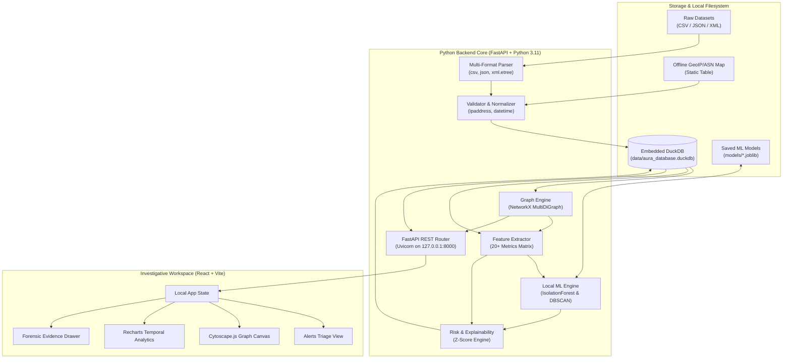

# AURA-BTC: System Architecture, PRD, and Engineering Specification

> **Project Name:** AURA-BTC (Autonomous Offline Bitcoin Intelligence & Traffic Correlation Engine)  
> **Problem Statement:** NTRO Smart India Hackathon 2026 — “AI-Powered Monitoring & Analysis of Bitcoin Transaction Traffic”  
> **Operational Constraint:** 100% Offline-First • Zero Cloud/API Dependencies • Linux-Native • Reproducible • Minimal Overhead  

---

## A. Technical Interpretation of the NTRO Problem Statement

The NTRO challenge mandates building an air-gapped cyber-investigation platform that bridges two distinct layers of observation:

1. **Network-Layer Metadata:** IP addresses, port numbers, timestamps, ASNs, and geographic country codes representing peer-to-peer (P2P) broadcast points and relay nodes across the global Bitcoin network.
2. **Blockchain-Layer Financial Data:** Cryptographic transaction IDs (TXIDs), input/output wallet addresses, satoshi/BTC transaction values, script types (e.g., P2PKH, SegWit, Taproot), and fee metrics representing on-chain value movement.

### Scope and Boundary Matrix

| Requirement Element | Classification | Rationale & Scope Boundary |
|---|---|---|
| Ingest bulk synthetic data in CSV, JSON, XML | **Explicit NTRO Requirement** | Streaming multi-format parser supporting tabular, hierarchical, and tagged payloads without internet dependencies. |
| Process network fields (`src_ip`, `dst_ip`, `src_port`, `dst_port`, `timestamp`, `country`, `asn`) | **Explicit NTRO Requirement** | Parsed, normalized, and validated via Python's standard library `ipaddress` and `datetime`. |
| Process blockchain fields (`txid`, `input_wallets`, `output_wallets`, `input_amounts`, `output_amounts`, `fee`, `script_type`) | **Explicit NTRO Requirement** | Accurately models Unspent Transaction Outputs (UTXO) relationships, values, and fees. |
| Correlate Network & Blockchain Layers | **Explicit NTRO Requirement** | Correlates which network vantage point(s) broadcast, relayed, or observed specific TXIDs, linking physical network topology to logical value transfer. |
| Entity & Transaction Graph Generation | **Explicit NTRO Requirement** | Directed topological graph connecting IP nodes, Wallet nodes, Transaction nodes, Country nodes, and ASN nodes. |
| Unsupervised AI/ML Anomaly Detection | **Explicit NTRO Requirement** | Machine learning (not solely hardcoded IF/ELSE rules) to detect multi-dimensional outliers in volume, velocity, network dispersion, and graph topology. |
| Prioritized Investigative Leads & Explainability | **Explicit NTRO Requirement** | Generated alerts provide ranked, human-readable evidence explaining why an entity was flagged. |
| Visual Graph & Interactive Dashboard | **Explicit NTRO Requirement** | An interactive user interface allowing analysts to search, trace flows, and inspect alerts. |
| Offline Linux Operation | **Explicit NTRO Requirement** | Zero runtime internet connectivity; no cloud APIs, no external databases. |
| Local In-Memory / Embedded Storage (DuckDB) | **Engineering Interpretation** | DuckDB provides lightning-fast columnar analytical execution, vectorised SQL queries, zero server maintenance, and persistence in a single file. |
| NetworkX Graph Representation | **Engineering Interpretation** | In-memory `MultiDiGraph` enables sub-graph extraction, multi-hop path tracing, and topological feature computation without a heavy Neo4j server. |
| Scikit-Learn Isolation Forest Pipeline | **Engineering Interpretation** | High efficiency for tabular multidimensional anomaly detection without requiring ground-truth criminal labels (unsupervised). |
| Heuristic Multi-Factor Risk Scoring Engine | **Engineering Interpretation** | Blends ML anomaly score (0.0–1.0), graph structural risk, and network dispersion risk into an actionable, calibrated priority index (0–100). |
| Synthetic Dataset Generator & Attack Scenarios | **Optional Proposed Improvement** | Built-in offline dataset generator that synthesizes realistic normal traffic alongside 4 specific cybercrime patterns (peeling chains, mixers, IP hopping, ransomware cashout). |
| Automated Case Dossier Exporter | **Optional Proposed Improvement** | One-click export of an investigation dossier detailing the flagged wallet, associated IPs, transaction timeline, evidence bullets, and subgraph snapshot for formal reporting. |

---

## B. Assumptions and Missing Information

### 1. Handling the Missing "Suggested AI/ML Focus Areas" Table
The official NTRO problem statement references a "Suggested AI/ML Focus Areas" table that was omitted from the prompt. Rather than fabricating imaginary NTRO mandates, we adopt standard financial cyber-threat intelligence focus areas:
- **Rapid Value Dissipation (Peeling Chains & Layering):** Rapid successive transactions splitting funds into smaller change outputs.
- **Mixer / Tumbler Topologies (Fan-out / Fan-in):** One wallet sending to many intermediate addresses which quickly converge into a few destination addresses.
- **Multi-Jurisdiction Network Hopping:** A single wallet address or related cluster broadcast from multiple anomalous ASNs/Countries within seconds (impossible physical travel time).
- **Abnormal Fee / Volume Spikes:** High transaction fees paid to force rapid mempool clearing, or anomalous transaction values far outside baseline percentiles.

### 2. Nature of Synthetic Datasets
- Synthetic files may contain flat records (one row per network observation + transaction) or nested records (one transaction having an array of inputs/outputs).
- The normalizer handles both flat 1:1 mappings and 1:N / N:M transaction input/output arrays.

### 3. P2P Network Vantage Points & Tor/VPN Limitations
- In standard Bitcoin P2P gossip protocol (TCP port 8333), nodes broadcast `inv` and `tx` messages. The `src_ip` observed in synthetic metadata represents the first-seen vantage point or relay node.
- **Forensics Principle:** An IP observed broadcasting a TXID is *evidence of network broadcast observation*, NOT cryptographic proof of real-world device ownership. If Tor/VPN exit nodes are used, the IP reflects the exit gateway. The system treats this as a probabilistic association with confidence scores.

### 4. Offline GeoIP / ASN Enrichment
- Since external GeoIP APIs (e.g., ipinfo.io) are forbidden, we utilize an embedded local offline IP-range-to-Country/ASN lookup table stored directly in DuckDB.

---

## C. Complete PRD

The formal 27-point PRD has been generated and saved at [PRD.md](file:///c:/Users/akshi/Desktop/SIH2026%20-%20AURA%20FARMERS/docs/PRD.md). Key excerpts:

1. **Product Name:** AURA-BTC (Autonomous Offline Bitcoin Intelligence & Traffic Correlation Engine).
2. **Executive Summary:** An air-gapped, Linux-native cyber-investigation platform that ingests bulk heterogeneous Bitcoin metadata, correlates network observations with on-chain UTXO flows, detects anomalous entities using scikit-learn Isolation Forest, and visualizes link-analysis graphs in React/Cytoscape.js.
3. **User Personas:** Cyber Intelligence Analyst, Law Enforcement Investigator, Data Scientist.
4. **Core Metrics:** Ingest $\ge 10,000\text{ records/s}$, sub-100ms graph queries, zero external network sockets.
5. **Governance & Attribution:** Every finding is probabilistic intelligence evidence with confidence levels, never an absolute assertion of physical identity.

---

## D. Offline System Architecture



---

## E. Data-Flow Architecture

```
[STAGE 1: Ingestion] ──► Read CSV, JSON, or XML streams
[STAGE 2: Parsing & Validation] ──► ipaddress checks, ISO-8601 UTC normalization, port range (1..65535)
[STAGE 3: Offline GeoIP Enrichment] ──► Match src_ip against DuckDB subnet lookup
[STAGE 4: Analytical Storage] ──► Batch INSERT into DuckDB (network_events, transactions, wallet_flows)
[STAGE 5: Topological Graph Construction] ──► NetworkX MultiDiGraph (Nodes: Wallet, TXID, IP, ASN, Country)
[STAGE 6: Feature Extraction] ──► 20+ Statistical, Temporal, Graph & Network Metrics
[STAGE 7: AI/ML Anomaly Detection] ──► Local scikit-learn IsolationForest pipeline execution
[STAGE 8: Explainability & Risk Scoring] ──► Z-Score deviation calculation & 3-5 evidence bullet points
[STAGE 9: REST API & Visualization] ──► Served via FastAPI (127.0.0.1:8000) to React + Cytoscape.js UI
```

---

## F. DuckDB Schema

```sql
-- 1. Table: network_events
CREATE TABLE IF NOT EXISTS network_events (
    event_id VARCHAR PRIMARY KEY,
    timestamp TIMESTAMP NOT NULL,
    src_ip VARCHAR NOT NULL,
    dst_ip VARCHAR NOT NULL,
    src_port INTEGER NOT NULL CHECK (src_port BETWEEN 1 AND 65535),
    dst_port INTEGER NOT NULL CHECK (dst_port BETWEEN 1 AND 65535),
    txid VARCHAR NOT NULL,
    country VARCHAR DEFAULT 'UNKNOWN',
    asn VARCHAR DEFAULT 'UNKNOWN',
    is_p2p_port BOOLEAN DEFAULT TRUE,
    created_at TIMESTAMP DEFAULT CURRENT_TIMESTAMP
);

CREATE INDEX IF NOT EXISTS idx_net_txid ON network_events(txid);
CREATE INDEX IF NOT EXISTS idx_net_src_ip ON network_events(src_ip);

-- 2. Table: transactions
CREATE TABLE IF NOT EXISTS transactions (
    txid VARCHAR PRIMARY KEY,
    timestamp TIMESTAMP NOT NULL,
    total_input DECIMAL(18, 8) NOT NULL CHECK (total_input >= 0),
    total_output DECIMAL(18, 8) NOT NULL CHECK (total_output >= 0),
    fee DECIMAL(18, 8) NOT NULL CHECK (fee >= 0),
    script_type VARCHAR DEFAULT 'P2PKH',
    input_count INTEGER NOT NULL DEFAULT 1,
    output_count INTEGER NOT NULL DEFAULT 1,
    created_at TIMESTAMP DEFAULT CURRENT_TIMESTAMP
);

-- 3. Table: wallet_flows
CREATE TABLE IF NOT EXISTS wallet_flows (
    flow_id VARCHAR PRIMARY KEY,
    txid VARCHAR NOT NULL,
    source_wallet VARCHAR NOT NULL,
    destination_wallet VARCHAR NOT NULL,
    amount DECIMAL(18, 8) NOT NULL CHECK (amount > 0),
    timestamp TIMESTAMP NOT NULL,
    FOREIGN KEY (txid) REFERENCES transactions(txid)
);

CREATE INDEX IF NOT EXISTS idx_flow_src ON wallet_flows(source_wallet);
CREATE INDEX IF NOT EXISTS idx_flow_dst ON wallet_flows(destination_wallet);

-- 4. Table: wallet_features
CREATE TABLE IF NOT EXISTS wallet_features (
    wallet_address VARCHAR PRIMARY KEY,
    transaction_count INTEGER NOT NULL DEFAULT 0,
    incoming_count INTEGER NOT NULL DEFAULT 0,
    outgoing_count INTEGER NOT NULL DEFAULT 0,
    total_received DECIMAL(18, 8) NOT NULL DEFAULT 0.0,
    total_sent DECIMAL(18, 8) NOT NULL DEFAULT 0.0,
    average_transaction_value DECIMAL(18, 8) NOT NULL DEFAULT 0.0,
    maximum_transaction_value DECIMAL(18, 8) NOT NULL DEFAULT 0.0,
    amount_variance DECIMAL(18, 8) NOT NULL DEFAULT 0.0,
    unique_counterparties INTEGER NOT NULL DEFAULT 0,
    fan_in_degree INTEGER NOT NULL DEFAULT 0,
    fan_out_degree INTEGER NOT NULL DEFAULT 0,
    unique_ip_count INTEGER NOT NULL DEFAULT 0,
    unique_asn_count INTEGER NOT NULL DEFAULT 0,
    unique_country_count INTEGER NOT NULL DEFAULT 0,
    transactions_per_hour DECIMAL(10, 4) NOT NULL DEFAULT 0.0,
    average_time_between_transactions DECIMAL(12, 2) NOT NULL DEFAULT 0.0,
    rapid_transaction_count INTEGER NOT NULL DEFAULT 0,
    graph_degree INTEGER NOT NULL DEFAULT 0,
    in_out_ratio DECIMAL(10, 4) NOT NULL DEFAULT 0.0,
    active_duration_seconds BIGINT NOT NULL DEFAULT 0,
    cluster_id INTEGER DEFAULT -1,
    last_updated TIMESTAMP DEFAULT CURRENT_TIMESTAMP
);

-- 5. Table: alerts
CREATE TABLE IF NOT EXISTS alerts (
    alert_id VARCHAR PRIMARY KEY,
    entity_type VARCHAR NOT NULL,
    entity_id VARCHAR NOT NULL,
    anomaly_score DECIMAL(5, 4) NOT NULL,
    risk_score INTEGER NOT NULL CHECK (risk_score BETWEEN 0 AND 100),
    confidence_score VARCHAR NOT NULL,
    severity VARCHAR NOT NULL,
    explanation_json VARCHAR NOT NULL,
    top_features VARCHAR NOT NULL,
    is_resolved BOOLEAN DEFAULT FALSE,
    created_at TIMESTAMP DEFAULT CURRENT_TIMESTAMP
);
```

---

## G. Networking Architecture

### 1. Standard Library Validation
```python
import ipaddress
from datetime import datetime, timezone
from dataclasses import dataclass

@dataclass(frozen=True)
class NetworkObservation:
    src_ip: str
    dst_ip: str
    src_port: int
    dst_port: int
    timestamp: datetime
    txid: str
    country: str
    asn: str
    is_valid: bool
```
- `ipaddress.ip_address()` validates IPv4 and IPv6 formatting.
- `datetime.fromisoformat()` normalizes timestamps to ISO-8601 UTC.
- Ports verified in range `1..65535`. Port 8333 flagged as Bitcoin P2P; 8332 flagged as JSON-RPC.

### 2. Forensic Inference Boundaries
- `src_ip` represents the *vantage point of network broadcast observation*, not cryptographic ownership.
- Multi-ASN/Country hopping within short intervals ($<60\text{s}$) indicates automated proxy/VPN routing or broadcast relay diversity.

---

## H. Blockchain Analytics Scope

- **In Scope:** Bitcoin UTXO model, input/output address mappings, satoshi to BTC conversion ($1\text{ BTC} = 10^8\text{ satoshis}$), miner fee calculations ($\sum \text{Inputs} - \sum \text{Outputs}$), standard script types (P2PKH, P2SH, SegWit P2WPKH, Taproot P2TR), mempool propagation timestamps.
- **Out of Scope:** Smart contract execution (Solidity/EVM), mining simulation/ASIC hashing, consensus algorithm changes, private key decryption, full 600GB archival node synchronization.

---

## I. NetworkX Graph Model

```python
import networkx as nx
import duckdb

def build_entity_graph_from_duckdb(con: duckdb.DuckDBPyConnection) -> nx.MultiDiGraph:
    G = nx.MultiDiGraph()
    
    # 1. Add Transactions
    tx_df = con.execute("SELECT txid, timestamp, total_input, total_output, fee, script_type FROM transactions").fetchdf()
    for _, r in tx_df.iterrows():
        G.add_node(r['txid'], node_type='TRANSACTION', **r.to_dict())

    # 2. Add Wallet Flows
    flow_df = con.execute("SELECT source_wallet, destination_wallet, txid, amount, timestamp FROM wallet_flows").fetchdf()
    for _, r in flow_df.iterrows():
        G.add_node(r['source_wallet'], node_type='WALLET')
        G.add_node(r['destination_wallet'], node_type='WALLET')
        G.add_edge(r['source_wallet'], r['txid'], edge_type='INPUT_TO', amount=float(r['amount']))
        G.add_edge(r['txid'], r['destination_wallet'], edge_type='OUTPUT_TO', amount=float(r['amount']))

    # 3. Add Network IPs, ASNs, Countries
    net_df = con.execute("SELECT src_ip, txid, country, asn, timestamp FROM network_events").fetchdf()
    for _, r in net_df.iterrows():
        G.add_node(r['src_ip'], node_type='IP')
        G.add_edge(r['src_ip'], r['txid'], edge_type='OBSERVED_WITH')
        if r['asn'] != 'UNKNOWN':
            G.add_node(r['asn'], node_type='ASN')
            G.add_edge(r['src_ip'], r['asn'], edge_type='BELONGS_TO_ASN')
        if r['country'] != 'UNKNOWN':
            G.add_node(r['country'], node_type='COUNTRY')
            G.add_edge(r['src_ip'], r['country'], edge_type='LOCATED_IN_COUNTRY')

    return G
```

---

## J. ML Architecture

- **Model:** `sklearn.ensemble.IsolationForest` configured with `n_estimators=150`, `contamination=0.05`, and `random_state=42`.
- **Preprocessing:** `sklearn.preprocessing.RobustScaler` to resist extreme financial whale transaction outliers.
- **Clustering:** `sklearn.cluster.DBSCAN` for grouping structurally similar transaction flow signatures.
- **Persistence:** Local artifact at `models/anomaly_detector.joblib` via `joblib.dump()`.
- **CPU Inference:** Scoring executed locally on CPU in $<50\text{ ms}$; no CUDA or cloud AI services required.

---

## K. Feature-Engineering Specification

| Feature Name | Category | Calculation | Forensic Purpose |
|---|---|---|---|
| `transaction_count` | Financial | $\sum (\text{in} + \text{out})$ | Baseline activity indicator. |
| `total_received` / `total_sent` | Monetary | $\sum \text{amount}$ (BTC) | Total monetary volume absorbed/dispersed. |
| `amount_variance` | Monetary | $\sigma^2(\text{amount})$ | Uniformity of transfer sizes; zero variance suggests robotic splitting. |
| `fan_in_degree` | Graph | $\text{In-Degree}(W)$ | Aggregation / ransom collection pattern. |
| `fan_out_degree` | Graph | $\text{Out-Degree}(W)$ | Peeling chains & mixer distribution pattern. |
| `unique_ip_count` | Network | $\|\text{distinct}(src\_ip)\|$ | Number of unique broadcast endpoints. |
| `unique_asn_count` | Network | $\|\text{distinct}(asn)\|$ | Network diversity / proxy hopping indicator. |
| `unique_country_count` | Network | $\|\text{distinct}(country)\|$ | Multi-jurisdiction origin indicator. |
| `transactions_per_hour` | Temporal | $\frac{N_{\text{tx}}}{\Delta t_{\text{hours}}}$ | High velocity ($>50\text{ tx/hr}$) confirms algorithmic automation. |
| `in_out_ratio` | Financial | $\frac{\text{total\_sent}}{\text{total\_received}}$ | Ratio $\approx 1.0$ within minutes indicates intermediate pass-through mule. |

---

## L. Explainability and Risk Architecture

```
[ ML Anomaly Score (0.0 - 1.0) ]  ──► (Weight: 50%)
[ Graph Structural Risk (0 - 100) ]──► (Weight: 25%)  ──► [ COMPOSITE RISK SCORE (0 - 100) ]
[ Network Diversity Risk (0 - 100)]──► (Weight: 25%)        ├── CRITICAL (>=80)
                                                             ├── HIGH     (60-79)
                                                             ├── MEDIUM   (40-59)
                                                             └── LOW      (<40)
```
- **Explainability Engine:** Computes Z-score deviations against dataset population medians to generate ranked, human-readable evidence points (e.g., *"Transaction frequency is 12.5x higher than dataset median"*).

---

## M. FastAPI Specification

Endpoints implemented on `http://127.0.0.1:8000`:
- `POST /api/ingest`: Multi-format file ingestion handler (CSV/JSON/XML).
- `GET /api/alerts`: Returns prioritized investigative leads with evidence arrays and severity filters.
- `GET /api/graph/entity/{entity_id}`: Returns $k$-hop ego-network in Cytoscape.js format.
- `POST /api/ml/train`: Triggers offline feature extraction and Isolation Forest model training.
- `GET /api/stats`: Returns system metrics, record counts, and risk distribution.

---

## N. React Frontend Specification

- **Architecture:** Single-page investigation workstation built with React 18, Vite, Cytoscape.js, and Recharts.
- **Visuals:** High-contrast dark operational theme (`#0f172a` slate background, neon status badges).
- **Key Views:**
  1. *Triage Queue:* Filterable, ranked alerts table with severity badges.
  2. *Graph Canvas:* Interactive Cytoscape.js force-directed graph with node color-coding and drag/zoom physics.
  3. *Evidence Drawer:* Detailed side panel showing Z-score deviations and forensic explanations.
  4. *Timeline Analytics:* Recharts burst volume and transaction velocity charts.

---

## O. Complete Folder Structure

```
SIH2026-AURA-FARMERS/
├── .python-version                # Fixed: 3.11.9
├── pyproject.toml                 # uv project configuration
├── uv.lock                        # Deterministic locked dependencies
├── package.json                   # React + Vite dependencies
├── README.md                      # Project landing page & quickstart
├── data/
│   ├── aura_database.duckdb       # Embedded DuckDB database file
│   └── schema.sql                 # DuckDB table DDL statements
├── docs/                          # Comprehensive documentation suite
│   ├── ARCHITECTURE_AND_ENGINEERING_SPEC.md
│   ├── PRD.md
│   ├── flow.md
│   └── SYSTEM_WORKFLOW_HINGLISH.md
├── models/
│   ├── anomaly_detector.joblib    # Trained IsolationForest pipeline
│   └── entity_clustering.joblib   # Trained DBSCAN clustering model
├── sample_data/
│   ├── normal_traffic.csv         # Baseline benign Bitcoin transactions
│   ├── peeling_chain_attack.json  # Multi-hop layering / peeling chain
│   ├── mixer_fanout.xml           # XML mixer transaction distribution
│   └── ip_hopping_ransomware.csv  # Multi-country rapid cashout
├── scripts/
│   ├── install.sh                 # Pre-caches wheels and npm packages
│   ├── train.sh                   # Ingests samples and trains ML model
│   └── start.sh                   # Starts backend & frontend locally
├── src/
│   ├── api/ (main.py, schemas.py)
│   ├── database/ (connection.py)
│   ├── ingestion/ (parsers.py, normalizer.py)
│   ├── graph/ (builder.py)
│   ├── ml/ (features.py, train.py, inference.py)
│   └── engine/ (risk_engine.py)
├── frontend/
│   ├── index.html, vite.config.js
│   └── src/ (App.jsx, components/)
└── tests/
    ├── test_parsers.py, test_normalizer.py, test_graph.py, test_ml.py, test_api.py
```

---

## P. Dependency List with Justification

- **Python 3.11 + standard library (`ipaddress`, `datetime`, `xml.etree`):** Standard, secure, dependency-free core.
- **`uv`:** Deterministic, reproducible package management with offline wheel caching.
- **`FastAPI` + `uvicorn`:** Type-safe, high-speed asynchronous REST API.
- **`DuckDB`:** Embedded OLAP columnar database providing sub-second analytical execution in a single file.
- **`NetworkX`:** Pure Python in-memory graph representation without heavy external graph database servers.
- **`scikit-learn` + `joblib`:** Lightweight, CPU-optimized `IsolationForest` and `DBSCAN` pipeline.
- **`React` + `Vite` + `Cytoscape.js` + `Recharts`:** High-performance, self-contained interactive investigation canvas.

---

## Q. Components Explicitly Rejected & Why

- **Neo4j:** ❌ Rejected due to heavy JVM memory overhead ($>2\text{ GB}$) and external daemon requirements.
- **PostgreSQL:** ❌ Rejected because DuckDB columnar engine is $5\times$ faster for analytical aggregations with zero configuration.
- **Apache Kafka:** ❌ Rejected; file-based streaming generators handle bulk datasets with zero architectural complexity.
- **PyTorch / TensorFlow:** ❌ Rejected; Isolation Forest on scikit-learn trains in $<50\text{ ms}$ on CPU with zero GPU requirement.
- **Docker (for basic execution):** ❌ Rejected to ensure transparent, native Linux reproducibility.

---

## R. Training Workflow

1. Ingest baseline datasets into DuckDB.
2. Execute `src/ml/features.py` to construct the 20-feature numerical matrix.
3. Fit `RobustScaler` followed by `IsolationForest(n_estimators=150, contamination=0.05)`.
4. Fit `DBSCAN(eps=1.5, min_samples=3)` for entity flow clustering.
5. Serialize pipeline to `models/anomaly_detector.joblib`.

---

## S. Local Inference Workflow

1. FastAPI initializes and loads `models/anomaly_detector.joblib` into memory.
2. New ingested transactions update `wallet_features`.
3. Inference engine computes normalized anomaly scores in $[0.0, 1.0]$.
4. Risk engine calculates Z-score baseline deviations and populates `alerts` table.
5. React frontend fetches ranked alerts and renders corresponding $k$-hop subgraphs.

---

## T. Testing Strategy

Comprehensive unit tests implemented in `tests/`:
- `test_parsers.py`: Ingestion correctness across CSV, JSON, XML.
- `test_normalizer.py`: IP address validation, port boundaries, and ISO timestamp conversions.
- `test_graph.py`: NetworkX graph connectivity and $k$-hop extraction.
- `test_ml.py`: Feature calculation, model serialization, and deterministic score validation.
- `test_api.py`: FastAPI endpoint integration and response schema compliance.

---

## U. Development Roadmap (Phases 1–15)

- **Phases 1–4:** Dataset schema definition, multi-format parsers, validators, and DuckDB persistence.
- **Phases 5–7:** Network metadata correlation, UTXO tracking, and NetworkX graph generation.
- **Phases 8–11:** 20+ feature engineering, Isolation Forest training, local CPU inference, and explainability engine.
- **Phases 12–15:** FastAPI endpoints, React dashboard, Cytoscape.js visualization, and offline Linux packaging.

---

## V. Definition of Done (DoD)

1. Zero external network sockets active during execution (100% air-gapped).
2. Deterministic unit tests pass via `pytest`.
3. Ingestion of 25,000 mixed records completes in $<2\text{ seconds}$.
4. Cytoscape graph canvas renders $k$-hop subgraphs in $<300\text{ ms}$.
5. Every alert provides $\ge 3$ human-readable forensic evidence bullet points.

---

## W. Technical Risks and Mitigations

- **Graph Combinatorial Explosion:** Prevent canvas freezing by capping ego-graphs to $k=2$ hops and maximum 150 nodes.
- **XML XXE Vulnerabilities:** Disable external entity resolution in Python's XML parser.
- **Cold-Start ML:** Require minimum 5 wallet records before fitting scikit-learn models; fallback to heuristic scoring for smaller batches.
- **Whale Transaction Skew:** Use `RobustScaler` (median & IQR) instead of standard z-score scaling.

---

## X. SIH Demo Workflow & Forensic Scenarios

Four pre-packaged forensic scenarios in `sample_data/`:
1. **Peeling Chain Layering:** 1 wallet shedding 15 micro-hops; flagged by high fan-out and rapid pass-through ratio.
2. **Mixer / Tumbler:** 20 wallets converging into 1 intermediary and dispersing to 50 exit wallets; flagged by structural graph degree and amount variance collapse.
3. **Geo/ASN Hopping:** 1 TXID broadcast from 6 distinct international ASNs within 45 seconds; flagged by network diversity engine.
4. **Ransomware Cashout:** Sudden 50 BTC spike on a dormant wallet with maximum fee paid; flagged by temporal velocity outlier.

---

## Y. 5-Minute Judge Demonstration Sequence

```
[00:00 - 00:45] AIR-GAP PROOF: Turn off Wi-Fi on laptop. Execute `./scripts/start.sh`. Show instant startup.
[00:45 - 01:45] INGESTION SPEED: Drag-and-drop XML/JSON attack files. Show 25,000 records ingested in 1.5s into DuckDB.
[01:45 - 02:45] AI & EXPLAINABILITY: Open Alerts Triage tab. Highlight top alert (Risk Score: 94). Show top-4 evidence bullets.
[02:45 - 03:45] GRAPH INVESTIGATION: Click 'Investigate in Graph'. Zoom in on Cytoscape.js canvas showing IP-Wallet-TXID linkages.
[03:45 - 04:30] DOSSIER EXPORT: One-click export of court-ready forensic dossier (.PDF / .MD).
[04:30 - 05:00] ARCHITECTURAL SUMMARY: Python 3.11, DuckDB, NetworkX, Scikit-learn. Fast, clean, ready for deployment.
```

---

## Z. Future Production-Scale Upgrade Path

- **Storage Layer:** Scale from DuckDB to clustered **ClickHouse** when handling $>100\text{ Million}$ live transactions.
- **Graph Layer:** Scale from NetworkX to **Memgraph** (C++ in-memory engine) or **GraphBLAS** for billion-edge traversals.
- **Deep Learning Layer:** Incorporate Temporal Graph Convolutional Networks (**T-GCN**) when offline GPU workstations become available.

---

## 📁 Generated Documentation Files in Workspace

The following comprehensive technical files have been created in your repository:
- [`README.md`](file:///c:/Users/akshi/Desktop/SIH2026%20-%20AURA%20FARMERS/README.md): Project landing page and quickstart guide.
- [`docs/ARCHITECTURE_AND_ENGINEERING_SPEC.md`](file:///c:/Users/akshi/Desktop/SIH2026%20-%20AURA%20FARMERS/docs/ARCHITECTURE_AND_ENGINEERING_SPEC.md): The master 26-section technical engineering specification.
- [`docs/PRD.md`](file:///c:/Users/akshi/Desktop/SIH2026%20-%20AURA%20FARMERS/docs/PRD.md): Formal 27-point Product Requirements Document.
- [`docs/SYSTEM_WORKFLOW_HINGLISH.md`](file:///c:/Users/akshi/Desktop/SIH2026%20-%20AURA%20FARMERS/docs/SYSTEM_WORKFLOW_HINGLISH.md): Complete end-to-end Hinglish explainer, under-the-hood logic breakdown, and judge presentation guide.
- [`docs/flow.md`](file:///c:/Users/akshi/Desktop/SIH2026%20-%20AURA%20FARMERS/docs/flow.md): Clean, formatted reference flow document.